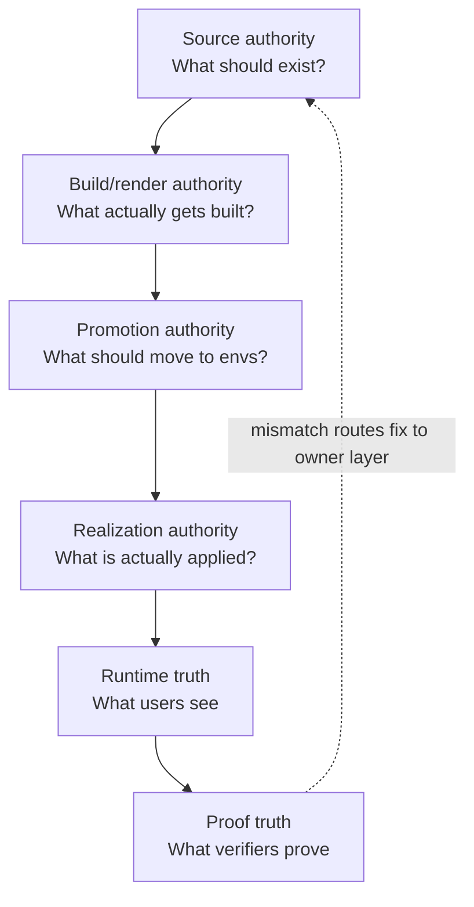
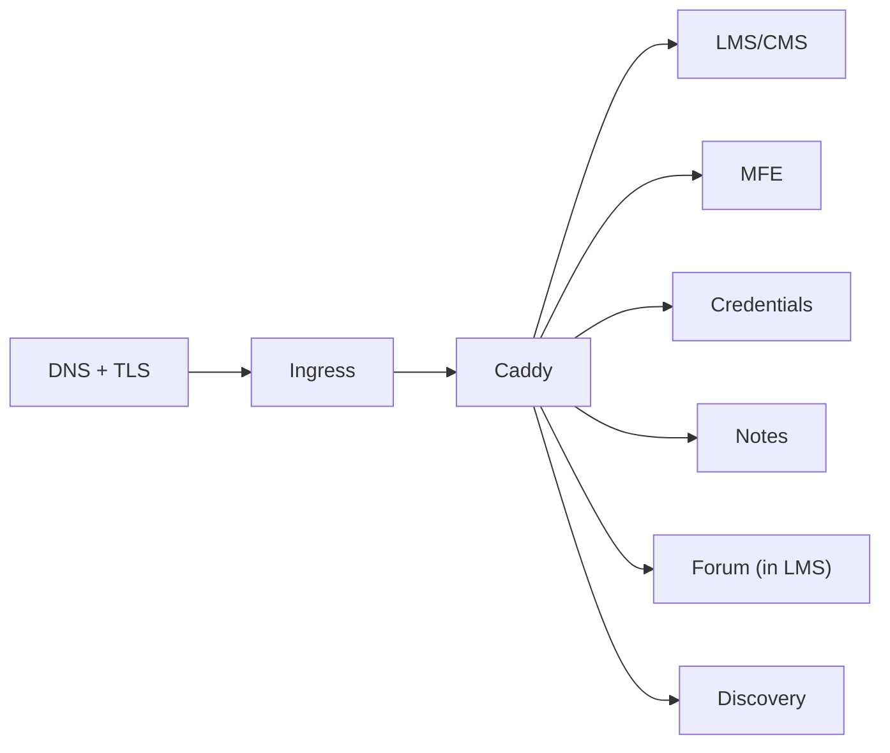
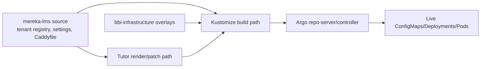

# PLATFORM_AUTHORITY_MAP
_Audience: Runtime/release/docs agents and operators · Owner: Platform Team · Status: canonical_

This is the authority map for troubleshooting and change ownership.

## Six-layer authority model

## Control plane A — public request path

## Control plane B — config/render path

## Layer-to-owner table

| Layer | Canonical question | Owning repo/files | Typical failure |
|---|---|---|---|
| Source authority | What should exist? | `deploy/k8s/tenancy/tenant-registry.yaml`, `deploy/k8s/base/**`, `specs/**` | duplicate/stale truth |
| Build/render authority | What actually gets built? | `infrastructure/tutor/**`, `infrastructure/tutor/patches/**`, build workflows | fix in source not in shipping path |
| Promotion authority | What should move? | release bundle + promotion scripts (`scripts/release/**`) | manual SHA/digest join |
| Realization authority | What is applied live? | Argo-managed overlays (infra repo), live manifests/pods | stale sync/partial rollout |
| Runtime truth | What users see? | live HTTP/browser behavior across active surfaces | white screen, empty 200, redirect break |
| Proof truth | Are checks trustworthy? | `scripts/qa/**`, `scripts/tenants/**`, `verification/**`, `docs/status/active/**` | false green/false red |

## Common failure modes by layer

| Layer | Failure mode | Example signal |
|---|---|---|
| Source | two surfaces both claim authority | app overlay and infra overlay disagree |
| Build/render | wrong shipping path patched | plugin file patched but rendered artifact unchanged |
| Promotion | release identity split | branch SHA, digest, and env patch manually joined |
| Realization | stale live object | Argo says synced but pod still old config/hash |
| Runtime | route/auth break | `/dashboard` blank, callback 5xx, empty 200 |
| Proof | verifier lies | check passes while user journey fails |

## How to choose owner layer

1. Name broken surface first (env + tenant + host + route).
2. Collect runtime evidence (status/body/redirect/screenshot).
3. Decide owner layer:
   - live user-visible break => runtime or realization
   - build artifact mismatch => build/render
   - wrong thing promoted => promotion
   - source contract wrong => source
   - verifier mismatch => proof
4. Patch only the owning layer first.
5. Add a regression guard at the escape layer.

## Explicit control-plane answers

- **Kustomize**: in the config/render path (source + overlays → rendered manifests).
- **Tutor**: in the build/render path for Open edX image/render generation.
- **Django settings ConfigMaps**: rendered config artifacts that pass through Kustomize and Argo to live pods.
- **Helm**: not in the canonical app release path for everyday mereka-lms deploys; any Helm use is platform/infrastructure scoped, not the primary app promotion path.

## Related

- [PROMOTION_REALIZATION_AND_INCIDENT_FLOW.md](PROMOTION_REALIZATION_AND_INCIDENT_FLOW.md)
- [AGENT_EXECUTION_WORKFLOW.md](../reference/operations/AGENT_EXECUTION_WORKFLOW.md)
- [VERIFIER_CONTRACT_CATALOG.md](../reference/contracts/VERIFIER_CONTRACT_CATALOG.md)
