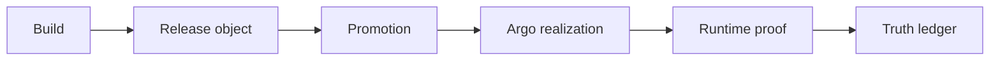
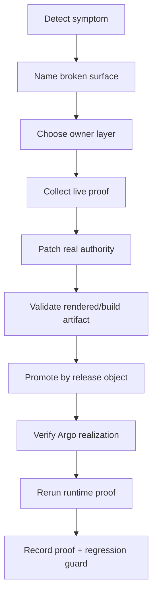

# PROMOTION_REALIZATION_AND_INCIDENT_FLOW
_Audience: Runtime/release/docs agents and operators · Owner: Platform Team · Status: canonical_

This doc defines the sanctioned path from build to proved runtime truth and the
incident triage workflow that prevents layer-mixing.

## Control plane C — release/proof path

## Four truths (do not collapse)

| Truth type | Meaning | Artifact example |
|---|---|---|
| Branch truth | fix exists on branch | PR diff |
| Merged truth | fix merged to main | merged commit |
| Realized truth | fix applied live | Argo sync + live image/config hash |
| Proved truth | user-visible behavior validated | browser/runtime proof artifact |

A fix is live only after **proved truth**, not after branch or merge truth.

## Incident triage / owner-layer workflow

## Before changing anything (collection checklist)

- broken surface (env/tenant/domain/route)
- owner-layer hypothesis
- source authority file
- rendered/build artifact currently shipping
- realized artifact currently live (image/config hashes)
- current proof artifact status
- whether worktree is clean

## Before calling a fix live

- fix merged to canonical branch
- fix present in rendered/build artifact
- release object created and used for promotion
- realization verified in Argo + live cluster
- runtime proof rerun against patched live bundle
- truth ledger updated
- regression guard added

## Debug without mixing layers

1. If runtime behavior is broken, do not start by editing docs or CI.
2. If verifier is green while runtime is red, patch verifier contract lane.
3. If source is fixed but runtime still broken, inspect build/render path first.
4. If build is correct but live is wrong, inspect promotion and realization.

## Related

- [PLATFORM_AUTHORITY_MAP.md](PLATFORM_AUTHORITY_MAP.md)
- [AGENT_EXECUTION_WORKFLOW.md](../reference/operations/AGENT_EXECUTION_WORKFLOW.md)
- [MASTER_LAUNCH_ROADMAP_2026-04-04.md](../status/active/MASTER_LAUNCH_ROADMAP_2026-04-04.md)
