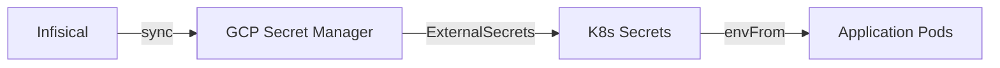

# Documentation Standards

**Audience**: All contributors (developers, agents, operators)
**Owner**: Platform Team
**Last verified**: 2026-02-12

This guide defines standards for all documentation in the Mereka Academy Open edX platform. Following these standards ensures consistency, maintainability, and machine-verifiable quality across all documentation types.

---

## Table of Contents

- [Document Types](#document-types)
- [Document Structure](#document-structure)
- [Writing Style](#writing-style)
- [Code Examples](#code-examples)
- [Verification Requirements](#verification-requirements)
- [Maintenance Requirements](#maintenance-requirements)
- [Review Checklist](#review-checklist)

---

## Document Types

### Runbooks (`docs/archive/superseded/runbooks/`)

**Purpose**: Operational procedures for maintaining and troubleshooting the platform.

**Required sections**:
- Metadata (Audience, Owner, Last verified/updated)
- Prerequisites
- Procedure (numbered steps with clear actions)
- Verification (how to confirm success)
- Troubleshooting (common failure modes)

**Example metadata format**:
```markdown
# Runbook Title
_Audience: Platform Eng + SRE • Owner: Engineering Lead • Last verified: 2026-02-12_
```

### Specifications (`specs/*.md`)

**Purpose**: Machine-checkable contracts defining system behavior.

**Required sections**:
- Frontmatter (YAML metadata)
- Human Summary (What/Why/Success looks like)
- Agent Contract (Scope, Non-goals, Assumptions)
- Requirements (Functional, Non-Functional)
- Acceptance Criteria (AC-XXX numbered items)

**Example frontmatter**:
```yaml
---
title: "Feature Name Specification"
type: "feature_spec"
status: "in_progress|completed|deprecated"
owner: "engineering"
vehicle: "talent_platform"
last_updated: "2026-02-12"
depends_on:
  - "specs/other-spec.md"
links:
  related_docs:
    - "docs/path/to/doc.md"
  related_specs:
    - "specs/other-spec.md"
---
```

### Architecture Decision Records (`docs/adr/`)

**Purpose**: Record significant architectural decisions and their rationale.

**Required sections**:
- Status (Proposed, Accepted, Deprecated, Superseded)
- Date
- Deciders
- Context
- Decision
- Consequences (Positive and Negative)
- Alternatives Considered
- Implementation Notes

**Naming**: `NNN-short-description.md` (e.g., `001-mongodb-atlas.md`)

### Guides (`docs/guides/onboarding/`, `docs/migrations/`)

**Purpose**: Step-by-step instructions for setting up, migrating, or learning the platform.

**Required sections**:
- Target audience
- Prerequisites
- Step-by-step procedure
- Verification checklist
- Next steps

**Quick start guides** should include:
- 🚀 Fast Setup (copy-paste ready)
- ✅ Verification Checklist
- 🔄 Daily Commands

---

## Document Structure

### Metadata Requirements

**All documentation MUST include metadata** for discoverability and maintenance:

| Document Type | Metadata Format | Required Fields |
|---------------|-----------------|-----------------|
| Runbooks | Italicized subtitle | `_Audience: X • Owner: Y • Last verified: YYYY-MM-DD_` |
| Specs | YAML frontmatter | `title`, `type`, `status`, `owner`, `last_updated` |
| ADRs | Section headers | `Status`, `Date`, `Deciders` |
| Guides | Italicized subtitle | `_For X • Purpose_` |

### Section Headers

- Use ATX-style headers (`#`, `##`, `###`)
- Top-level document title is `#` (H1)
- Major sections are `##` (H2)
- Subsections are `###` (H3)
- Maximum depth: H4 (`####`)

### Table of Contents

**Required for documents >500 lines or >5 major sections.**

Format:
```markdown
## Table of Contents

- [Section Name](#section-name)
- [Another Section](#another-section)
  - [Subsection](#subsection)
```

### Visual Separators

Use horizontal rules (`---`) to separate major sections in long documents.

---

## Writing Style

### Clarity and Conciseness

**DO**:
- Use active voice: "Run the command" (not "The command should be run")
- Start procedures with action verbs: "Create", "Configure", "Deploy"
- Use present tense: "The system validates credentials" (not "will validate")
- Break complex sentences into simple ones
- Use lists for multiple items
- Define acronyms on first use: "Kubernetes (K8s)"

**DON'T**:
- Use passive voice: "The configuration is updated by the operator"
- Use future tense: "The system will then validate"
- Nest more than 3 levels of bullets
- Use jargon without definition

### Voice and Tone

- **Technical documentation**: Direct, precise, authoritative
- **Runbooks**: Imperative (commands), concise
- **Guides**: Supportive, step-by-step
- **ADRs**: Neutral, analytical

### Formatting Conventions

| Element | Format | Example |
|---------|--------|---------|
| File paths | Inline code | `` `deploy/k8s/base/` `` |
| Commands | Inline code | `` `kubectl get pods` `` |
| Environment vars | Inline code | `` `MYSQL_HOST` `` |
| URLs | Inline code | `` `https://academyv2.mereka.io` `` |
| Service names | Inline code | `` `lms`, `mongodb` `` |
| Emphasis | **Bold** | **CRITICAL**, **Required** |
| Warnings | **Bold + ALL CAPS** | **DO NOT** commit secrets |

### Emoji Usage

**Use sparingly** and only in specific contexts:

| Context | Allowed Emojis | Purpose |
|---------|---------------|---------|
| Runbooks | 🚨 ⚠️ ✅ 🔧 | Section markers (alerts, checks, fixes) |
| Guides | 🚀 ✅ 🔄 📝 | Step markers (setup, verify, iterate, notes) |
| Specs/ADRs | ❌ None | Professional tone |

---

## Code Examples

### Inline vs Fenced Code Blocks

**Inline code** (`` `code` ``) for:
- File paths
- Command names
- Single variables
- Short values

**Fenced code blocks** (` ``` `) for:
- Multi-line commands
- Configuration files
- Output examples
- Scripts

### Bash Code Blocks

**MUST include**:
1. **Language identifier**: ` ```bash `
2. **Command description** (preceding comment or text)
3. **Expected output** (when relevant)

**Example**:
```markdown
Check if pods are running:

```bash
kubectl get pods -n mereka-lms
```

Expected output:
```
NAME                       READY   STATUS    RESTARTS   AGE
lms-5f8b9c7d6-abcde        1/1     Running   0          2h
cms-7c9d8e6f5-fghij        1/1     Running   0          2h
```
```

### Command Descriptions

**Good**:
```markdown
# 1. Authenticate Docker with Artifact Registry
gcloud auth configure-docker asia-southeast1-docker.pkg.dev

# 2. Build Open edX platform (takes 30-45 min, needs 12GB+ RAM)
tutor images build openedx
```

**Bad**:
```markdown
# Do the thing
gcloud auth configure-docker asia-southeast1-docker.pkg.dev

# Build
tutor images build openedx
```

### Configuration Examples

**DO**:
- Show complete examples
- Highlight required vs optional fields
- Include comments for non-obvious values
- Show both correct and incorrect patterns (when illustrative)

**Example**:
```markdown
**Correct** (local Docker Compose):
```yaml
MYSQL_HOST: mysql        # Docker Compose service name
REDIS_HOST: redis        # Local container
```

**Incorrect** (cloud IPs in local config):
```yaml
MYSQL_HOST: 10.97.0.2    # DON'T: Cloud SQL proxy IP
```
```

### Output Examples

When showing command output:
1. Use fenced code blocks without language identifier
2. Truncate long output with `...` and indicate line count
3. Highlight key lines with comments

```markdown
```
NAME                       READY   STATUS    RESTARTS
lms-5f8b9c7d6-abcde        1/1     Running   0
cms-7c9d8e6f5-fghij        1/1     Running   0
...
(15 more pods)
```
```

---

## Verification Requirements

### Automated CI/CD Verification

All documentation changes are automatically verified in CI/CD:

**On Pull Request** (fast checks <5 min):
- Documentation standards compliance (`verify-documentation-standards.sh`)
- Spec coverage report generation (no execution)
- Spec linting (errors only)
- Testmap format validation
- Markdown linting (warnings, non-blocking)
- Internal link checking (warnings, non-blocking)

**On Merge to Main** (full suite):
- All PR checks
- 150+ verification scripts across 13 groups:
  - Repository structure
  - Secrets management
  - K8s deployment
  - MongoDB Atlas
  - Multi-site configuration
  - Branding
  - Forum
  - Tutor configuration
  - Observability
  - CI/CD
  - MFE
  - Authentication
  - Migrations
  - Enterprise services

See [`.github/workflows/ci.yml`](../../../.github/workflows/ci.yml) for complete workflow configuration (spec verification is handled in the `static-validation` and `full-verification` jobs; the former `verify-specs.yml` was merged into `ci.yml` in Phase 4 consolidation).

### Local Verification

Run before pushing to catch issues early:

```bash
# Documentation standards check
./scripts/qa/verify-documentation-standards.sh

# Spec coverage report
python3 scripts/qa/spec-tools/spec_coverage_report.py \
  --specs-dir specs/ \
  --repo-root . \
  --format text

# Link checking
./scripts/qa/verify-documentation-links.sh

# Specific verification scripts
./scripts/qa/verify-repo-structure.sh
./scripts/qa/verify-k8s-deployment-spec.sh
```

### Every Guide MUST Have a Verification Script

**Location**: `scripts/qa/verify-<topic>.sh`

**Requirements**:
1. Executable (`chmod +x`)
2. Shebang: `#!/usr/bin/env bash`
3. Error handling: `set -euo pipefail`
4. Color output helpers (RED, GREEN, YELLOW, NC)
5. Exit code: 0 = success, 1 = failure
6. `@covers` annotation for spec coverage
7. `@spec:` annotation for spec scoping

**Example**:
```bash
#!/usr/bin/env bash
# @covers AC-004, AC-005, AC-006
# @spec: k8s-deployment_spec.md
set -euo pipefail

# Colors
RED='\033[0;31m'
GREEN='\033[0;32m'
YELLOW='\033[1;33m'
NC='\033[0m'

# Counters
PASS_COUNT=0
FAIL_COUNT=0

pass() {
    echo -e "${GREEN}✓ PASS${NC}: $1"
    PASS_COUNT=$((PASS_COUNT + 1))
}

fail() {
    echo -e "${RED}✗ FAIL${NC}: $1"
    FAIL_COUNT=$((FAIL_COUNT + 1))
}

# Verification logic
check_namespace() {
    if kubectl get namespace mereka-lms &>/dev/null; then
        pass "Namespace mereka-lms exists"
    else
        fail "Namespace mereka-lms not found"
    fi
}

# Run checks
check_namespace

# Summary
echo ""
echo "Results: $PASS_COUNT passed, $FAIL_COUNT failed"
[[ $FAIL_COUNT -eq 0 ]] && exit 0 || exit 1
```

### @covers Annotations

**Purpose**: Link code/scripts to acceptance criteria (ACs) in specs.

**Format**:
```bash
# @covers AC-001, AC-002, AC-003
# @spec: secrets-management_spec.md
```

**Rules**:
1. **Space-separated AC IDs DON'T WORK** - use commas: `AC-001, AC-002`
2. **Always include `@spec:`** - prevents AC-001 collision across 31 specs
3. **One `@spec:` per file** - tool captures LAST annotation
4. Supports prefixed ACs: `AC-TCR-001`, `AC-CCR-002`

### Manual Verification

**When automated verification is impractical**:
- Browser interactions (dashboard rendering)
- Visual regression (screenshots)
- Long-running processes (TTL-based deletion)
- External dependencies (Stripe webhooks)

**Add to** `specs/manual_verifications.yaml`:
```yaml
entries:
- id: AC-005
  spec: analytics-pipeline_spec.md
  description: Pre-built dashboards visible in Superset for staff users
  verify:
  - type: manual
    runbook: docs/ops/runbooks/ANALYTICS_RUNBOOK.md
    section: Dashboard Verification
    justification: Verifying dashboard load time < 5s and visual correctness requires browser interaction that cannot be automated with kubectl alone
```

### Monitoring Verification

**When verification requires observability tools**:
```yaml
- id: AC-002
  spec: analytics-pipeline_spec.md
  description: xAPI events flow to ClickHouse
  verify:
  - type: monitoring
    metric: clickhouse_xapi_events_count
    dashboard: grafana://dashboards/analytics-pipeline
```

---

## Maintenance Requirements

### Quarterly Review Schedule

**All documentation MUST be reviewed quarterly**:

| Quarter | Focus Areas |
|---------|-------------|
| Q1 | Runbooks, Troubleshooting |
| Q2 | Onboarding, Developer Guides |
| Q3 | Specs, ADRs (mark deprecated) |
| Q4 | Architecture, Migrations |

### Last Verified Date

**Update `Last verified` metadata** when:
- You execute the procedure successfully
- You verify all commands still work
- You update content based on changes
- You review and confirm accuracy

**Format**: `YYYY-MM-DD` (ISO 8601)

### Deprecation Process

**When a document becomes obsolete**:

1. **Update status** in metadata:
   - Specs: `status: deprecated`
   - ADRs: `Status: Superseded by ADR-XXX`
   - Runbooks: Add `⚠️ DEPRECATED` banner

2. **Add deprecation notice** at the top:
   ```markdown
   > **DEPRECATED**: This document is no longer maintained. See `new-doc.md` instead.
   ```

3. **Move to archive** (if not referenced elsewhere):
   - Specs: Keep in place (for historical reference)
   - Runbooks: Move to `docs/archive/superseded/runbooks/`
   - Guides: Move to `docs/archive/guides/`

4. **Update links**: Search for references and update to new document.

### Breaking Changes

**When updating documentation with breaking changes**:

1. Update the document with new content
2. Add a "Migration" section explaining the change
3. Update `Last verified` date
4. Notify team via commit message: `docs!: breaking change to X`
5. Update dependent documentation within 48 hours

---

## Review Checklist

### Pre-Commit Checks

**Before committing documentation, verify**:

- [ ] Metadata present and complete (Audience, Owner, Last verified/updated)
- [ ] No hardcoded secrets (pre-commit hook enforces)
- [ ] No broken internal links (`docs/`, `specs/`, `scripts/`)
- [ ] No trailing whitespace (run `sed -i 's/[[:space:]]*$//'`)
- [ ] Code blocks have language identifiers
- [ ] Commands have descriptions
- [ ] File paths use backticks (`` `path/to/file` ``)

**Automated**:
```bash
# Pre-commit hook runs automatically
# Manual check:
.githooks/pre-commit
```

### Peer Review Requirements

**All documentation changes require**:

1. **Self-review**:
   - Read the rendered Markdown (GitHub preview or VS Code)
   - Execute all commands in a clean environment
   - Verify verification scripts pass

2. **Peer review** (for major changes):
   - Runbook changes: SRE team member
   - Spec changes: Spec owner + one other engineer
   - ADRs: Architecture review (async via PR comments)
   - Guides: Test with a new team member (if available)

### Technical Accuracy Verification

**For operational documentation (runbooks, guides)**:

1. **Execute in a clean environment**:
   - Local: Fresh Tutor installation
   - Cloud: Staging cluster (if available) or production (with caution)

2. **Capture evidence**:
   - Command outputs (screenshots or text)
   - Verification script results
   - Metrics/logs confirming expected behavior

3. **Update metadata**:
   - Set `Last verified: YYYY-MM-DD` to today's date
   - Add reviewer name in commit message

**For specifications**:

1. **Run verification scripts**: `scripts/qa/verify-<spec>.sh`
2. **Check coverage**: `scripts/qa/spec-tools/spec_coverage_report.py specs/<spec>.md`
3. **Validate AC mapping**: Ensure all `@covers` annotations reference valid AC IDs

---

## Common Patterns

### Mermaid Diagrams

**Use Mermaid for**:
- Architecture diagrams
- Sequence diagrams (API flows)
- State machines
- Deployment flows

**Example**:
```markdown

```

**DON'T use Mermaid for**:
- File trees (use ASCII art)
- Simple lists (use bullet points)
- Tables (use Markdown tables)

### Tables

**Use tables for**:
- Comparison matrices
- Configuration options
- Metadata summaries

**Format**:
```markdown
| Column 1 | Column 2 | Column 3 |
|----------|----------|----------|
| Value A  | Value B  | Value C  |
```

**Alignment**:
- Left: Default
- Right: End header with `---:`
- Center: Wrap header with `:---:`

### Callout Boxes

**Use blockquotes for callouts**:

```markdown
> **CRITICAL**: This is a critical note.

> **NOTE**: This is informational.

> **WARNING**: This is a warning.
```

---

## Anti-Patterns to Avoid

### Documentation Smells

**Avoid**:
- ❌ "As mentioned above" (use links)
- ❌ "Obviously" or "Simply" (condescending)
- ❌ "TODO" or "FIXME" (create an issue instead)
- ❌ Outdated dates (update or remove)
- ❌ Vague prerequisites ("some knowledge of X")
- ❌ Commands without context ("Run this: `kubectl apply`")
- ❌ Missing exit criteria ("do this until it works")

### Common Mistakes

**File paths**:
- ❌ `tools/` (deprecated, use `scripts/`)
- ❌ `ops/` (deprecated, use `infrastructure/` or `scripts/`)
- ✅ `scripts/`, `infrastructure/`, `deploy/`

**Service names**:
- ❌ `10.97.0.2` (cloud IP in local docs)
- ✅ `mysql`, `redis`, `mongodb` (Docker Compose names)

**Secret management**:
- ❌ `PASSWORD = "actual-password"` (hardcoded)
- ✅ `PASSWORD = os.environ.get("MYSQL_PASSWORD")` (from env)

---

## Tools and Resources

### Linting

**Markdown linting** (recommended):
```bash
# Install markdownlint-cli
npm install -g markdownlint-cli

# Lint all docs
markdownlint docs/ specs/

# Auto-fix common issues
markdownlint --fix docs/ specs/
```

### Spell Checking

**Use VS Code extension**: `streetsidesoftware.code-spell-checker`

**Custom dictionary**: Add project-specific terms to `.vscode/settings.json`:
```json
{
  "cSpell.words": [
    "Tutor",
    "Infisical",
    "Kustomize",
    "kubectl"
  ]
}
```

### Link Checking

**Check for broken links**:
```bash
# Install markdown-link-check
npm install -g markdown-link-check

# Check all docs
find docs/ specs/ -name "*.md" -exec markdown-link-check {} \;
```

---

## Examples

### Minimal Runbook

```markdown
# Service Restart Runbook
_Audience: SRE • Owner: Platform Team • Last verified: 2026-02-12_

Quick procedure for restarting Open edX services.

## Prerequisites

- `kubectl` configured for `mereka-lms` cluster
- Access to `mereka-lms` namespace

## Procedure

1. Restart LMS pods:
   ```bash
   kubectl rollout restart deployment/lms -n mereka-lms
   ```

2. Verify pods are healthy:
   ```bash
   kubectl get pods -n mereka-lms -l app.kubernetes.io/name=lms
   ```

## Verification

- [ ] All pods show `Running` status
- [ ] LMS accessible at https://academyv2.mereka.io
- [ ] No errors in logs: `kubectl logs -n mereka-lms -l app.kubernetes.io/name=lms --tail=50`

## Troubleshooting

**Pods stuck in `Pending`**: Check resource quotas with `kubectl describe pod <pod-name> -n mereka-lms`
```

### Minimal Spec

```markdown
---
title: "Feature Name"
type: "feature_spec"
status: "in_progress"
owner: "engineering"
last_updated: "2026-02-12"
---

# Human Summary

## What we're building
A brief description of the feature.

## Why it matters
The business/technical value.

## Success looks like
Measurable outcomes.

# Agent Contract

## Requirements

### Functional

#### AC-001: User authentication
Given a valid user, when they log in, then they receive a session token.

### Non-Functional Requirements

See [Cross-Cutting Requirements](../../../specs/cross-cutting-requirements_spec.md) for shared NFRs.

- Performance: Login completes in <2s (p95)
- Security: Passwords hashed with bcrypt (cost factor 12)
```

---

## Quick Reference

### Document Type Decision Tree

```
What are you writing?
│
├─ Operational procedure? → Runbook (docs/archive/superseded/runbooks/)
├─ System behavior contract? → Spec (specs/*_spec.md)
├─ Architecture decision? → ADR (docs/adr/NNN-title.md)
├─ Setup/migration guide? → Guide (docs/guides/onboarding/ or docs/migrations/)
└─ Troubleshooting? → Runbook or update TROUBLESHOOTING.md
```

### Checklist: New Documentation

```
[ ] Metadata present (Audience, Owner, Last verified/updated)
[ ] Required sections included per document type
[ ] Commands have descriptions and expected output
[ ] File paths use backticks
[ ] No hardcoded secrets
[ ] Verification script created (for guides/specs)
[ ] @covers annotations added (for verification scripts)
[ ] Internal links validated
[ ] Reviewed by peer (for major changes)
```

### Common Commands

```bash
# Verify documentation standards compliance
./scripts/qa/verify-documentation-standards.sh

# Check spec coverage
./scripts/qa/spec-tools/spec_coverage_report.py specs/<spec-name>_spec.md

# Run all QA verification scripts
make qa-smoke

# Lint markdown (optional)
markdownlint docs/ specs/

# Check for broken links (optional)
markdown-link-check docs/**/*.md
```

---

## Questions?

- **Spec format**: See existing specs in `specs/`
- **Runbook format**: See `docs/archive/superseded/runbooks/DEPLOYMENT_RUNBOOK.md`
- **ADR format**: See `docs/adr/001-mongodb-atlas.md`
- **Verification scripts**: See `scripts/qa/verify-*.sh`

**For clarification**, open an issue with the `documentation` label.
