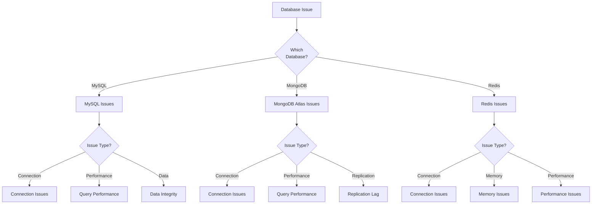

# Database Issues Runbook
_Audience: SRE + Platform Eng • Owner: SRE • Last verified: 2026-02-12_

This runbook provides procedures for diagnosing and resolving database issues across MySQL, MongoDB Atlas, and Redis.

## 🎯 When to Use This Runbook

Use this runbook when experiencing:
- Database connection failures
- Slow database queries (>1s)
- Connection pool exhaustion
- Replication lag
- Data consistency issues
- Database crashes or restarts

## 📊 Database Diagnostic Decision Tree



## 🔧 MySQL Issues

### Connection Failures

**Symptoms:**
- Errors: `Can't connect to MySQL server`
- Errors: `Too many connections`
- LMS/CMS unable to start

**Diagnostics:**

```bash
# 1. Check if MySQL pod is running
kubectl get pods -n mereka-lms -l app.kubernetes.io/name=mysql

# 2. Check MySQL logs
kubectl logs -n mereka-lms -l app.kubernetes.io/name=mysql --tail=100

# 3. Check connection count
kubectl exec -n mereka-lms deployment/mysql -- mysql -u root \
  -p$(kubectl get secret -n mereka-lms mysql -o jsonpath='{.data.MYSQL_ROOT_PASSWORD}' | base64 -d) \
  -e "SHOW STATUS LIKE 'Threads_connected';"

# 4. Check max connections limit
kubectl exec -n mereka-lms deployment/mysql -- mysql -u root \
  -p$(kubectl get secret -n mereka-lms mysql -o jsonpath='{.data.MYSQL_ROOT_PASSWORD}' | base64 -d) \
  -e "SHOW VARIABLES LIKE 'max_connections';"
```

**Resolution:**

```bash
# Option 1: Restart MySQL pod (if crashed)
kubectl rollout restart deployment -n mereka-lms mysql

# Option 2: Increase max_connections (requires MySQL config change)
# Edit mysql ConfigMap and add:
# [mysqld]
# max_connections = 500

# Option 3: Kill idle connections
kubectl exec -n mereka-lms deployment/mysql -- mysql -u root \
  -p$(kubectl get secret -n mereka-lms mysql -o jsonpath='{.data.MYSQL_ROOT_PASSWORD}' | base64 -d) \
  -e "SELECT CONCAT('KILL ', id, ';') FROM information_schema.processlist WHERE Command='Sleep' AND Time > 300;"
```

### Slow Queries

**Symptoms:**
- Page loads taking >5s
- Database CPU high (>80%)
- Query timeouts in logs

**Diagnostics:**

```bash
# 1. Enable slow query log (if not already enabled)
kubectl exec -n mereka-lms deployment/mysql -- mysql -u root \
  -p$(kubectl get secret -n mereka-lms mysql -o jsonpath='{.data.MYSQL_ROOT_PASSWORD}' | base64 -d) \
  -e "SET GLOBAL slow_query_log = 'ON'; SET GLOBAL long_query_time = 1;"

# 2. Check current queries
kubectl exec -n mereka-lms deployment/mysql -- mysql -u root \
  -p$(kubectl get secret -n mereka-lms mysql -o jsonpath='{.data.MYSQL_ROOT_PASSWORD}' | base64 -d) \
  -e "SHOW FULL PROCESSLIST;"

# 3. Analyze slow query log
kubectl exec -n mereka-lms deployment/mysql -- mysqldumpslow /var/lib/mysql/slow-query.log
```

**Resolution:**

```bash
# 1. Kill long-running queries
kubectl exec -n mereka-lms deployment/mysql -- mysql -u root \
  -p$(kubectl get secret -n mereka-lms mysql -o jsonpath='{.data.MYSQL_ROOT_PASSWORD}' | base64 -d) \
  -e "KILL <query_id>;"

# 2. Optimize tables
kubectl exec -n mereka-lms deployment/mysql -- mysql -u root \
  -p$(kubectl get secret -n mereka-lms mysql -o jsonpath='{.data.MYSQL_ROOT_PASSWORD}' | base64 -d) \
  -e "OPTIMIZE TABLE openedx.auth_user, openedx.student_courseenrollment;"

# 3. Add indexes (requires engineering analysis)
# Document slow queries and create Jira ticket for index optimization
```

### Data Integrity Issues

**Symptoms:**
- Foreign key constraint violations
- Duplicate key errors
- Data corruption

**Diagnostics:**

```bash
# 1. Check for corrupted tables
kubectl exec -n mereka-lms deployment/mysql -- mysqlcheck -u root \
  -p$(kubectl get secret -n mereka-lms mysql -o jsonpath='{.data.MYSQL_ROOT_PASSWORD}' | base64 -d) \
  --all-databases --check

# 2. Check foreign key constraints
kubectl exec -n mereka-lms deployment/mysql -- mysql -u root \
  -p$(kubectl get secret -n mereka-lms mysql -o jsonpath='{.data.MYSQL_ROOT_PASSWORD}' | base64 -d) \
  -e "SELECT * FROM information_schema.INNODB_SYS_FOREIGN WHERE FOR_NAME LIKE 'openedx%';"
```

**Resolution:**

```bash
# 1. Repair tables
kubectl exec -n mereka-lms deployment/mysql -- mysqlcheck -u root \
  -p$(kubectl get secret -n mereka-lms mysql -o jsonpath='{.data.MYSQL_ROOT_PASSWORD}' | base64 -d) \
  --all-databases --repair

# 2. Restore from backup (if corruption severe)
# See: docs/operations/runbooks/DISASTER_RECOVERY.md

# 3. Run migrations to fix schema
kubectl exec -n mereka-lms deployment/lms -- ./manage.py lms migrate --settings=tutor.production
```

## 🍃 MongoDB Atlas Issues

### Connection Failures

**Symptoms:**
- Errors: `Failed to connect to MongoDB`
- Errors: `Authentication failed`
- Forum/Modulestore unavailable

**Diagnostics:**

```bash
# 1. Check MongoDB connection string
kubectl get secret -n mereka-lms mongodb -o jsonpath='{.data.MONGODB_HOST}' | base64 -d

# 2. Test connection from LMS pod
kubectl exec -n mereka-lms deployment/lms -- python -c "
from pymongo import MongoClient
import os
client = MongoClient(os.environ['MONGODB_HOST'])
print(client.server_info())
"

# 3. Check Atlas cluster status
# Visit: https://cloud.mongodb.com/
# Navigate to: Clusters → cluster-mereka-lms → Metrics
```

**Resolution:**

```bash
# 1. Verify credentials in Infisical
# Secret: MEREKA_LMS_MONGODB_PASSWORD

# 2. Update ExternalSecret if needed
kubectl apply -f deploy/k8s/base/secrets/external-secrets.yaml

# 3. Force secret sync
kubectl delete pod -n external-secrets-operator -l app.kubernetes.io/name=external-secrets

# 4. Restart LMS/CMS pods to pick up new credentials
kubectl rollout restart deployment -n mereka-lms lms cms
```

### Query Performance Issues

**Symptoms:**
- Slow forum loading
- Course content loading >3s
- High Atlas CPU usage

**Diagnostics:**

```bash
# 1. Check Atlas Performance Advisor
# Visit: https://cloud.mongodb.com/ → Performance Advisor

# 2. Check query profile
# Use Atlas UI → Performance → Profiler

# 3. Test query from LMS
kubectl exec -n mereka-lms deployment/lms -- python manage.py lms shell -c "
from xmodule.modulestore.django import modulestore
ms = modulestore()
# Run test query
"
```

**Resolution:**

```bash
# 1. Add indexes (via Atlas UI or migration)
# Create indexes recommended by Performance Advisor

# 2. Upgrade Atlas tier (if needed)
# Navigate to: Cluster → Edit Configuration → Cluster Tier

# 3. Enable profiler (if not enabled)
# Navigate to: Cluster → Profiler → Enable

# 4. Clear cache to force fresh queries
kubectl exec -n mereka-lms deployment/redis -- redis-cli FLUSHALL
```

### Replication Lag

**Symptoms:**
- Data not available immediately after write
- Stale data served
- Replication lag alerts

**Diagnostics:**

```bash
# Check replication status in Atlas UI
# Navigate to: Cluster → Metrics → Replication Lag

# Check secondary node status
# Navigate to: Cluster → View Monitoring → Replica Set
```

**Resolution:**

```bash
# 1. Wait for replication to catch up (usually automatic)
# Monitor: Metrics → Replication Lag

# 2. If lag persistent, escalate to Atlas support
# May need to scale Atlas tier

# 3. Temporary mitigation: Force read from primary
# Update connection string to use primary read preference
# (requires code change - escalate to engineering)
```

## 🔴 Redis Issues

### Connection Failures

**Symptoms:**
- Errors: `Redis connection refused`
- Cache not working
- Session failures

**Diagnostics:**

```bash
# 1. Check Redis pod status
kubectl get pods -n mereka-lms -l app.kubernetes.io/name=redis

# 2. Check Redis logs
kubectl logs -n mereka-lms -l app.kubernetes.io/name=redis --tail=100

# 3. Test connection from LMS
kubectl exec -n mereka-lms deployment/lms -- python -c "
import redis
r = redis.Redis(host='redis', port=6379)
print(r.ping())
"
```

**Resolution:**

```bash
# 1. Restart Redis pod
kubectl rollout restart deployment -n mereka-lms redis

# 2. Check service endpoints
kubectl get endpoints -n mereka-lms redis

# 3. Verify network policy (if applicable)
kubectl get networkpolicies -n mereka-lms
```

### Memory Issues

**Symptoms:**
- Redis OOMKilled restarts
- High memory usage (>90%)
- Eviction warnings in logs

**Diagnostics:**

```bash
# 1. Check memory usage
kubectl exec -n mereka-lms deployment/redis -- redis-cli INFO memory

# 2. Check eviction policy
kubectl exec -n mereka-lms deployment/redis -- redis-cli CONFIG GET maxmemory-policy

# 3. Check key count
kubectl exec -n mereka-lms deployment/redis -- redis-cli DBSIZE
```

**Resolution:**

```bash
# 1. Increase Redis memory limit
kubectl set resources deployment -n mereka-lms redis \
  --limits=memory=4Gi \
  --requests=memory=2Gi

# 2. Set appropriate eviction policy
kubectl exec -n mereka-lms deployment/redis -- redis-cli CONFIG SET maxmemory-policy allkeys-lru

# 3. Clear cache if needed
kubectl exec -n mereka-lms deployment/redis -- redis-cli FLUSHALL

# 4. Consider Redis persistence (RDB/AOF) for large datasets
# Requires Redis configuration change
```

### Performance Issues

**Symptoms:**
- Slow cache operations
- High Redis CPU (>80%)
- Command timeouts

**Diagnostics:**

```bash
# 1. Check slowlog
kubectl exec -n mereka-lms deployment/redis -- redis-cli SLOWLOG GET 10

# 2. Monitor commands
kubectl exec -n mereka-lms deployment/redis -- redis-cli MONITOR

# 3. Check client connections
kubectl exec -n mereka-lms deployment/redis -- redis-cli CLIENT LIST
```

**Resolution:**

```bash
# 1. Increase Redis CPU
kubectl set resources deployment -n mereka-lms redis \
  --limits=cpu=2000m \
  --requests=cpu=1000m

# 2. Optimize slow commands
# Review slowlog and optimize application code

# 3. Consider Redis Cluster for horizontal scaling
# (requires architecture change - escalate to engineering)
```

## 📊 Database Health Checks

### MySQL Health Check

```bash
#!/bin/bash
# File: scripts/qa/verify-mysql-health.sh

kubectl exec -n mereka-lms deployment/mysql -- mysql -u root \
  -p$(kubectl get secret -n mereka-lms mysql -o jsonpath='{.data.MYSQL_ROOT_PASSWORD}' | base64 -d) \
  -e "
SELECT 'MySQL Status' as Check_Name, 'PASS' as Result;
SELECT 'Uptime' as Metric, VARIABLE_VALUE as Value FROM performance_schema.global_status WHERE VARIABLE_NAME='Uptime';
SELECT 'Connections' as Metric, VARIABLE_VALUE as Value FROM performance_schema.global_status WHERE VARIABLE_NAME='Threads_connected';
SELECT 'Max Connections' as Metric, VARIABLE_VALUE as Value FROM performance_schema.global_variables WHERE VARIABLE_NAME='max_connections';
SELECT 'Slow Queries' as Metric, VARIABLE_VALUE as Value FROM performance_schema.global_status WHERE VARIABLE_NAME='Slow_queries';
"
```

### MongoDB Atlas Health Check

```bash
#!/bin/bash
# File: scripts/qa/verify-mongodb-health.sh

kubectl exec -n mereka-lms deployment/lms -- python -c "
from pymongo import MongoClient
import os
import json

client = MongoClient(os.environ['MONGODB_HOST'])
print('Connection: PASS')
print('Server Info:', json.dumps(client.server_info(), indent=2))
print('Database Names:', client.list_database_names())
"
```

### Redis Health Check

```bash
#!/bin/bash
# File: scripts/qa/verify-redis-health.sh

kubectl exec -n mereka-lms deployment/redis -- redis-cli <<EOF
PING
INFO server
INFO stats
INFO memory
INFO replication
EOF
```

## 🚨 Escalation

### When to Escalate

Escalate to DBA/Engineering when:
- Data loss suspected
- Performance degradation persists after optimization
- Schema changes required
- Replication issues unresolved
- Database upgrade needed

### Information to Collect

```bash
# 1. MySQL diagnostics
kubectl exec -n mereka-lms deployment/mysql -- mysql -u root \
  -p$(kubectl get secret -n mereka-lms mysql -o jsonpath='{.data.MYSQL_ROOT_PASSWORD}' | base64 -d) \
  -e "SHOW FULL PROCESSLIST; SHOW ENGINE INNODB STATUS;" > /tmp/mysql-diagnostics.txt

# 2. MongoDB Atlas metrics screenshot
# From: https://cloud.mongodb.com/ → Performance tab

# 3. Redis diagnostics
kubectl exec -n mereka-lms deployment/redis -- redis-cli INFO ALL > /tmp/redis-diagnostics.txt

# 4. Application logs
kubectl logs -n mereka-lms -l app.kubernetes.io/name=lms --tail=1000 | grep -i "database\|mysql\|mongo\|redis" > /tmp/app-db-logs.txt
```

## 📚 Related Runbooks

- [Performance Degradation](performance-degradation.md) - For overall performance issues
- [Site Down](site-down.md) - For complete outages
- [Disaster Recovery](DISASTER_RECOVERY.md) - For backup/restore procedures
- [Scaling](scaling.md) - For scaling database resources

## ✅ Verification

After resolution:

```bash
# 1. Verify MySQL health
./scripts/qa/verify-mysql-health.sh

# 2. Verify MongoDB health
./scripts/qa/verify-mongodb-health.sh

# 3. Verify Redis health
./scripts/qa/verify-redis-health.sh

# 4. Test application functionality
curl -I https://academyv2.mereka.io
curl -I https://academyv2.mereka.io/courses
curl -I https://academyv2.mereka.io/dashboard

# 5. Monitor for 15 minutes
watch -n 60 'kubectl top pods -n mereka-lms'
```

Expected results:
- All health checks PASS
- No database errors in logs
- Application responding <2s
- No pod restarts
