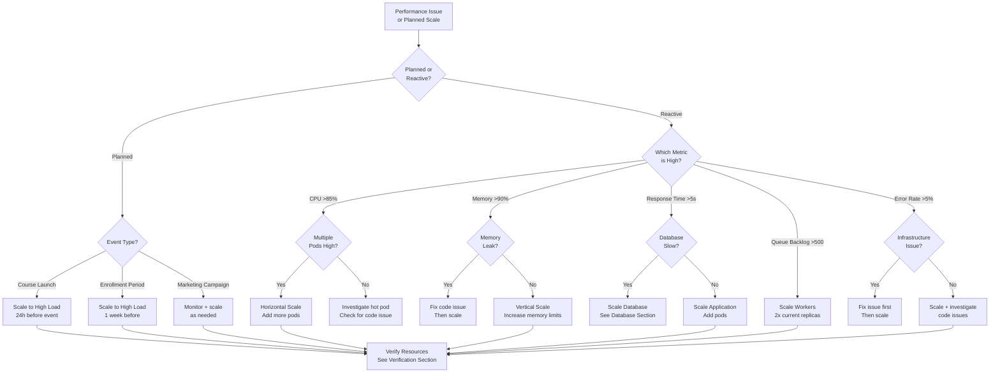
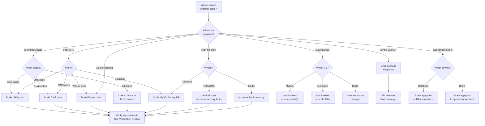

# Scaling Runbook
_Audience: SRE + Platform Eng • Owner: SRE • Last verified: 2026-02-12_

This runbook provides comprehensive procedures for scaling the Mereka LMS platform, including when to scale, how to scale, and cost considerations.

## 🎯 When to Use This Runbook

Use this runbook when:
- Planning for expected traffic increases (course launches, enrollment periods)
- Responding to performance degradation under load
- Implementing auto-scaling policies
- Optimizing resource allocation and costs
- Right-sizing infrastructure after load testing

## 📊 When to Scale - Metrics Thresholds

### Scale UP Triggers

| Metric | Warning | Critical | Action |
|--------|---------|----------|--------|
| **CPU Usage** | >70% sustained | >85% sustained | Scale horizontally (add pods) |
| **Memory Usage** | >75% sustained | >90% sustained | Scale vertically (increase limits) |
| **Response Time (P95)** | >2s | >5s | Scale LMS/CMS pods |
| **Error Rate** | >1% | >5% | Scale immediately + investigate |
| **Queue Backlog** | >100 tasks | >500 tasks | Scale workers |
| **Database Connections** | >70% of max | >90% of max | Scale app pods or DB |
| **Cache Hit Rate** | <80% | <60% | Increase Redis memory |
| **Active Users** | >500 concurrent | >1000 concurrent | Scale proactively |

**Sustained** = metric stays above threshold for >5 minutes

### Scale DOWN Triggers

| Metric | Threshold | Action |
|--------|-----------|--------|
| **CPU Usage** | <30% for >30 min | Consider reducing replicas |
| **Memory Usage** | <40% for >30 min | Consider reducing limits |
| **Off-Peak Hours** | Nights/weekends | Scale to minimum (cost optimization) |
| **Low Traffic** | <50 active users | Scale to baseline |

### Capacity Baselines

| Environment | Users | Req/sec | LMS Pods | CMS Pods | Workers |
|-------------|-------|---------|----------|----------|---------|
| **Minimum** (off-peak) | 0-50 | 5 | 1 | 1 | 1 each |
| **Baseline** (normal) | 50-200 | 10-20 | 2 | 1 | 2/1 |
| **High Load** (peak) | 200-500 | 20-50 | 4 | 2 | 4/2 |
| **Spike** (launch day) | 500-1000 | 50-100 | 8 | 3 | 6/3 |

## 🌲 Scaling Decision Tree



## 💰 Cost Considerations

### GKE Node Pool Costs

**Current Setup** (production):
- **Node Type**: n2-standard-4 (4 vCPU, 16 GB RAM)
- **Cost**: ~$120/month per node
- **Baseline**: 2 nodes (~$240/month)
- **Peak**: 4 nodes (~$480/month)

**Cost Optimization Strategies**:

1. **Use Autoscaler** (recommended):
   ```yaml
   # Automatically scales nodes 2-4 based on demand
   minNodes: 2
   maxNodes: 4
   ```
   - **Savings**: ~$120-240/month during off-peak
   - **Trade-off**: 1-3 min node startup time

2. **Preemptible Nodes** (for non-critical workloads):
   - **Savings**: ~60% cost reduction ($48/node)
   - **Trade-off**: Can be terminated with 30s notice
   - **Use for**: Development, testing, non-critical workers

3. **Spot Pods** (worker pods):
   ```yaml
   # For batch workers that can tolerate interruptions
   nodeSelector:
     cloud.google.com/gke-spot: "true"
   ```
   - **Savings**: ~60-80% reduction
   - **Trade-off**: May be terminated anytime

### Pod Resource Costs

**Cost per pod** (rough estimates based on n2-standard-4 pricing):

| Workload | CPU Request | Memory Request | Cost/hour | Cost/month |
|----------|-------------|----------------|-----------|------------|
| LMS | 1000m | 2Gi | $0.05 | $36 |
| CMS | 500m | 2Gi | $0.04 | $29 |
| Worker | 500m | 1Gi | $0.03 | $22 |
| Redis | 500m | 1Gi | $0.03 | $22 |
| MySQL | 1000m | 2Gi | $0.05 | $36 |

**Scaling Cost Impact**:

| Action | Additional Cost/Month | When to Use |
|--------|----------------------|-------------|
| Add 1 LMS pod | ~$36 | CPU >70%, Response time >2s |
| Add 1 CMS pod | ~$29 | CMS slow, course authoring issues |
| Add 2 workers | ~$44 | Queue backlog >100 tasks |
| Double Redis memory | ~$11 | Cache hit rate <80% |
| Add MySQL replica | ~$36 | Read-heavy, query latency >500ms |

**Cost vs Performance Trade-offs**:

- **Under-provisioning**: Risk downtime, poor UX, lost revenue
- **Over-provisioning**: Wasted budget, but guaranteed performance
- **Recommendation**: Start with baseline + HPA, scale proactively for known events

### Database Scaling Costs

**MySQL** (Cloud SQL - future consideration):

| Tier | vCPU | RAM | Cost/month | Use Case |
|------|------|-----|------------|----------|
| db-n1-standard-1 | 1 | 3.75 GB | $48 | Dev/testing |
| db-n1-standard-2 | 2 | 7.5 GB | $96 | Small production |
| db-n1-standard-4 | 4 | 15 GB | $192 | Current production |
| db-n1-standard-8 | 8 | 30 GB | $384 | High load |

**MongoDB Atlas** (current):

| Tier | vCPU | RAM | Storage | Cost/month | Use Case |
|------|------|-----|---------|------------|----------|
| M10 | 2 | 2 GB | 10 GB | $60 | Current dev |
| M20 | 2 | 4 GB | 20 GB | $120 | Small production |
| M30 | 2 | 8 GB | 40 GB | $240 | Current production |
| M40 | 4 | 16 GB | 80 GB | $480 | High load |

**Redis** (Memorystore - future consideration):

| Tier | Capacity | Cost/month | Use Case |
|------|----------|------------|----------|
| Standard M1 | 1 GB | $41 | Dev |
| Standard M2 | 5 GB | $204 | Production |
| Standard M3 | 10 GB | $408 | High cache |

## 🔄 Horizontal vs Vertical Scaling Decision

### Horizontal Scaling (Add More Pods)

**When to Use**:
- ✅ CPU-bound workloads (CPU >70%)
- ✅ Need high availability (multi-pod redundancy)
- ✅ Traffic spikes (can scale quickly)
- ✅ Stateless services (LMS, CMS, workers)

**Advantages**:
- Better fault tolerance (pod dies, others handle traffic)
- Faster scaling (seconds to add pod vs minutes to resize)
- Can scale down easily during off-peak

**Disadvantages**:
- More network overhead (load balancing)
- Requires shared state (sessions in Redis/DB)
- May hit node capacity (requires node scaling)

**Cost**: Linear increase (~$30-40/pod/month)

### Vertical Scaling (Increase Pod Resources)

**When to Use**:
- ✅ Memory-bound workloads (Memory >85%)
- ✅ Single-threaded bottlenecks
- ✅ Database connections limited
- ✅ Stateful services (MySQL, Redis)

**Advantages**:
- Simpler (fewer pods to manage)
- Lower network overhead
- Better for memory-intensive tasks

**Disadvantages**:
- Requires pod restart (brief downtime)
- Single point of failure (if only 1 pod)
- Node size limits (max 16 GB RAM on n2-standard-4)

**Cost**: Proportional to resource increase (~$10-20/GB memory/month)

### Decision Matrix

| Symptom | Horizontal | Vertical | Why |
|---------|------------|----------|-----|
| CPU >85% on all pods | ✅ | ❌ | Need more compute capacity |
| CPU >85% on 1 pod | ❌ | Investigate | Likely code issue |
| Memory >90% | ❌ | ✅ | Memory doesn't scale horizontally |
| Response time >5s | ✅ | ❌ | Need more request handlers |
| Database connections >90% | ✅ | ❌ | Spread connections across pods |
| Queue backlog growing | ✅ | ❌ | Need more worker throughput |
| Cache hit rate low | ❌ | ✅ | Need larger cache |

## 📝 Scaling Procedures

### LMS/CMS Horizontal Scaling

#### Manual Scaling

```bash
# 1. Check current replicas
kubectl get deployment lms cms -n mereka-lms

# 2. Check current resource usage
kubectl top pods -n mereka-lms -l 'app.kubernetes.io/name in (lms,cms)'

# 3. Scale LMS (baseline: 2, peak: 4-8)
kubectl scale deployment lms --replicas=4 -n mereka-lms

# 4. Scale CMS (baseline: 1, peak: 2-3)
kubectl scale deployment cms --replicas=2 -n mereka-lms

# 5. Verify new pods are ready
kubectl get pods -n mereka-lms -l 'app.kubernetes.io/name in (lms,cms)' -w

# 6. Check service endpoints (should show all pods)
kubectl get endpoints lms cms -n mereka-lms

# 7. Verify load distribution
kubectl top pods -n mereka-lms -l 'app.kubernetes.io/name in (lms,cms)'
```

**Expected timeline**: 2-3 minutes for pods to be ready

#### HPA Configuration (Recommended for Production)

```yaml
# File: deploy/k8s/base/apps/lms-hpa.yaml
apiVersion: autoscaling/v2
kind: HorizontalPodAutoscaler
metadata:
  name: lms-hpa
  namespace: mereka-lms
spec:
  scaleTargetRef:
    apiVersion: apps/v1
    kind: Deployment
    name: lms
  minReplicas: 2
  maxReplicas: 8
  metrics:
  - type: Resource
    resource:
      name: cpu
      target:
        type: Utilization
        averageUtilization: 70
  - type: Resource
    resource:
      name: memory
      target:
        type: Utilization
        averageUtilization: 80
  behavior:
    scaleUp:
      stabilizationWindowSeconds: 60
      policies:
      - type: Percent
        value: 50
        periodSeconds: 60
      - type: Pods
        value: 2
        periodSeconds: 60
      selectPolicy: Max
    scaleDown:
      stabilizationWindowSeconds: 300
      policies:
      - type: Percent
        value: 25
        periodSeconds: 60
      selectPolicy: Min
---
apiVersion: autoscaling/v2
kind: HorizontalPodAutoscaler
metadata:
  name: cms-hpa
  namespace: mereka-lms
spec:
  scaleTargetRef:
    apiVersion: apps/v1
    kind: Deployment
    name: cms
  minReplicas: 1
  maxReplicas: 3
  metrics:
  - type: Resource
    resource:
      name: cpu
      target:
        type: Utilization
        averageUtilization: 70
  behavior:
    scaleUp:
      stabilizationWindowSeconds: 60
      policies:
      - type: Pods
        value: 1
        periodSeconds: 60
    scaleDown:
      stabilizationWindowSeconds: 300
      policies:
      - type: Pods
        value: 1
        periodSeconds: 300
```

**Apply HPA**:

```bash
# 1. Apply HPA configuration
kubectl apply -f deploy/k8s/base/apps/lms-hpa.yaml

# 2. Verify HPA is active
kubectl get hpa -n mereka-lms

# 3. Watch HPA behavior
kubectl get hpa -n mereka-lms -w

# 4. Check HPA status details
kubectl describe hpa lms-hpa -n mereka-lms
```

**HPA Tuning Parameters**:

- `minReplicas: 2` - Minimum pods (always-on baseline)
- `maxReplicas: 8` - Maximum pods (cost cap)
- `averageUtilization: 70` - Scale when average CPU >70%
- `stabilizationWindowSeconds: 60` - Wait 1 min before scaling up
- `stabilizationWindowSeconds: 300` - Wait 5 min before scaling down

### LMS/CMS Vertical Scaling

**When to Use**: Memory >85%, OOMKilled events

```bash
# 1. Check current resource limits
kubectl get deployment lms -n mereka-lms -o jsonpath='{.spec.template.spec.containers[0].resources}'

# 2. Backup current deployment
kubectl get deployment lms -n mereka-lms -o yaml > /tmp/lms-deployment-backup.yaml

# 3. Increase memory limits (example: 2Gi -> 4Gi)
kubectl patch deployment lms -n mereka-lms --type='json' -p='[
  {
    "op": "replace",
    "path": "/spec/template/spec/containers/0/resources/requests/memory",
    "value": "3Gi"
  },
  {
    "op": "replace",
    "path": "/spec/template/spec/containers/0/resources/limits/memory",
    "value": "6Gi"
  }
]'

# 4. Watch rollout (pods will restart)
kubectl rollout status deployment lms -n mereka-lms

# 5. Verify new limits
kubectl get pods -n mereka-lms -l app.kubernetes.io/name=lms -o jsonpath='{.items[0].spec.containers[0].resources}'

# 6. Monitor memory usage
kubectl top pods -n mereka-lms -l app.kubernetes.io/name=lms
```

**Standard Resource Profiles**:

| Profile | CPU Request | CPU Limit | Memory Request | Memory Limit | Use Case |
|---------|-------------|-----------|----------------|--------------|----------|
| **Small** | 500m | 1000m | 1Gi | 2Gi | Dev, CMS |
| **Medium** | 1000m | 2000m | 2Gi | 4Gi | Production LMS (baseline) |
| **Large** | 2000m | 4000m | 4Gi | 8Gi | High load LMS |
| **XLarge** | 4000m | 8000m | 8Gi | 16Gi | Peak load (requires larger nodes) |

### Worker Scaling

**Workers** (lms-worker, cms-worker): Handle async tasks (emails, grades, certificates)

#### Manual Scaling

```bash
# 1. Check queue backlog
kubectl exec -n mereka-lms deployment/lms -- python -c "
from celery import Celery
app = Celery('openedx.core.celery')
app.config_from_object('django.conf:settings', namespace='CELERY')
inspect = app.control.inspect()
stats = inspect.stats()
print('Workers:', len(stats) if stats else 0)
"

# 2. Check current worker replicas
kubectl get deployment lms-worker cms-worker -n mereka-lms

# 3. Scale workers (baseline: 2/1, peak: 4-6/2-3)
kubectl scale deployment lms-worker --replicas=4 -n mereka-lms
kubectl scale deployment cms-worker --replicas=2 -n mereka-lms

# 4. Verify workers are consuming tasks
kubectl logs -n mereka-lms -l app.kubernetes.io/name=lms-worker --tail=50 | grep -i "received\|succeeded\|failed"
```

**When to scale workers**:
- Queue backlog >100 tasks for >5 minutes
- Task processing time >30s average
- User complaints about delayed emails/certificates
- Bulk operations scheduled (mass email, grade recalculation)

#### Worker HPA (Optional)

```yaml
# File: deploy/k8s/base/apps/worker-hpa.yaml
apiVersion: autoscaling/v2
kind: HorizontalPodAutoscaler
metadata:
  name: lms-worker-hpa
  namespace: mereka-lms
spec:
  scaleTargetRef:
    apiVersion: apps/v1
    kind: Deployment
    name: lms-worker
  minReplicas: 2
  maxReplicas: 6
  metrics:
  - type: Resource
    resource:
      name: cpu
      target:
        type: Utilization
        averageUtilization: 70
  - type: Resource
    resource:
      name: memory
      target:
        type: Utilization
        averageUtilization: 80
```

**Note**: Worker HPA scales based on CPU/memory, not queue depth. For queue-based scaling, consider KEDA (Kubernetes Event Driven Autoscaling).

### MySQL Scaling

**Current**: In-cluster MySQL (single pod, PVC-backed)

#### Vertical Scaling (Current Setup)

```bash
# 1. Check current resource usage
kubectl top pod -n mereka-lms -l app.kubernetes.io/name=mysql

# 2. Backup before scaling (CRITICAL)
./scripts/infra/backup-mysql.sh

# 3. Increase MySQL resources
kubectl patch deployment mysql -n mereka-lms --type='json' -p='[
  {
    "op": "replace",
    "path": "/spec/template/spec/containers/0/resources/requests/memory",
    "value": "4Gi"
  },
  {
    "op": "replace",
    "path": "/spec/template/spec/containers/0/resources/limits/memory",
    "value": "8Gi"
  }
]'

# 4. Wait for pod to restart
kubectl rollout status deployment mysql -n mereka-lms

# 5. Verify connectivity
kubectl exec -n mereka-lms deployment/lms -- python -c "
import MySQLdb
conn = MySQLdb.connect(host='mysql', port=3306, user='openedx', passwd='PASSWORD', db='openedx')
print('✓ MySQL connected')
conn.close()
"
```

**Downtime**: 30-60 seconds during pod restart

#### Read Replica (Future Enhancement)

```yaml
# For read-heavy workloads, add read replica
apiVersion: apps/v1
kind: Deployment
metadata:
  name: mysql-read-replica
  namespace: mereka-lms
spec:
  replicas: 1
  selector:
    matchLabels:
      app.kubernetes.io/name: mysql-read-replica
  template:
    spec:
      containers:
      - name: mysql
        image: mysql:8.0
        env:
        - name: MYSQL_REPLICATION_MODE
          value: "slave"
        - name: MYSQL_MASTER_HOST
          value: "mysql"
        resources:
          requests:
            memory: 2Gi
            cpu: 1000m
          limits:
            memory: 4Gi
            cpu: 2000m
```

**When to add read replica**:
- Read queries >70% of total
- Query latency >500ms P95
- Master CPU >80% sustained

### Redis Scaling

**Current**: In-cluster Redis (single pod)

#### Vertical Scaling (Increase Memory)

```bash
# 1. Check Redis memory usage
kubectl exec -n mereka-lms deployment/redis -- redis-cli INFO memory | grep "used_memory_human"

# 2. Check cache hit rate
kubectl exec -n mereka-lms deployment/redis -- redis-cli INFO stats | grep "keyspace_hits\|keyspace_misses"

# 3. Increase Redis memory if hit rate <80%
kubectl patch deployment redis -n mereka-lms --type='json' -p='[
  {
    "op": "replace",
    "path": "/spec/template/spec/containers/0/resources/limits/memory",
    "value": "4Gi"
  }
]'

# 4. Update Redis maxmemory config
kubectl exec -n mereka-lms deployment/redis -- redis-cli CONFIG SET maxmemory 3758096384  # 3.5Gi in bytes

# 5. Verify new memory limit
kubectl exec -n mereka-lms deployment/redis -- redis-cli CONFIG GET maxmemory
```

**Cache Hit Rate Calculation**:
```bash
# Get hits and misses
HITS=$(kubectl exec -n mereka-lms deployment/redis -- redis-cli INFO stats | grep keyspace_hits | cut -d: -f2 | tr -d '\r')
MISSES=$(kubectl exec -n mereka-lms deployment/redis -- redis-cli INFO stats | grep keyspace_misses | cut -d: -f2 | tr -d '\r')

# Calculate hit rate
HIT_RATE=$(echo "scale=2; $HITS / ($HITS + $MISSES) * 100" | bc)
echo "Cache hit rate: $HIT_RATE%"
```

**Target hit rate**: >90% (80-90% = warning, <80% = scale memory)

#### Redis Sentinel (High Availability - Future)

For production HA, consider Redis Sentinel or Memorystore:

```yaml
# 3-pod Redis Sentinel setup
apiVersion: apps/v1
kind: StatefulSet
metadata:
  name: redis
  namespace: mereka-lms
spec:
  serviceName: redis
  replicas: 3
  selector:
    matchLabels:
      app.kubernetes.io/name: redis
  template:
    spec:
      containers:
      - name: redis
        image: redis:7-alpine
        command:
        - redis-server
        - /conf/redis.conf
        resources:
          requests:
            memory: 2Gi
            cpu: 500m
          limits:
            memory: 4Gi
            cpu: 1000m
```

### MongoDB Atlas Scaling

**Current**: MongoDB Atlas M30 (2 vCPU, 8 GB RAM)

**Scaling via Atlas Console**:

1. **Login to Atlas**: https://cloud.mongodb.com/
2. **Navigate**: Clusters → cluster-mereka-lms
3. **Click**: "Edit Configuration"
4. **Select tier**:
   - M30 (current): $240/month, 8 GB RAM
   - M40 (2x): $480/month, 16 GB RAM
   - M50 (4x): $960/month, 32 GB RAM
5. **Apply changes**: ~10-15 min rolling upgrade

**When to scale MongoDB**:
- Query latency >500ms P95
- CPU >80% sustained
- Connections >90% of limit
- Storage >70% used

**Monitor via Atlas**:
```bash
# Check MongoDB Atlas metrics (requires mongosh + connection string)
mongosh "mongodb+srv://cluster-mereka-lms.2pjex4s.mongodb.net/" \
  --username admin \
  --eval "
    db.serverStatus().connections;
    db.serverStatus().opcounters;
  "
```

**Scaling checklist**:
- ✅ Backup before scaling (Atlas auto-backup)
- ✅ Review slow query logs
- ✅ Add indexes if needed (may avoid scaling)
- ✅ Scale during low-traffic window
- ✅ Verify application connectivity after

### MFE Scaling

**Micro-frontends**: Static assets served by Caddy, minimal resource needs

```bash
# Rarely needed, but if MFE pod is slow:
kubectl scale deployment mfe --replicas=2 -n mereka-lms

# Or increase memory (webpack builds can be memory-intensive)
kubectl patch deployment mfe -n mereka-lms --type='json' -p='[
  {
    "op": "replace",
    "path": "/spec/template/spec/containers/0/resources/limits/memory",
    "value": "2Gi"
  }
]'
```

**Note**: MFEs are mostly static files. Scaling Caddy is more effective for serving MFE traffic.

### Discovery/Ecommerce/Notes Scaling

**Lower-priority services**: Scale only if specifically impacted

```bash
# Check usage first
kubectl top pods -n mereka-lms -l 'app.kubernetes.io/name in (discovery,ecommerce,notes)'

# Scale if needed (rare)
kubectl scale deployment discovery --replicas=2 -n mereka-lms
kubectl scale deployment ecommerce --replicas=2 -n mereka-lms
kubectl scale deployment notes --replicas=2 -n mereka-lms
```

**When to scale**:
- Discovery: Course catalog search slow (>3s)
- Ecommerce: Payment processing slow (>5s)
- Notes: Note-taking feature slow (>2s)

## ✅ Scaling Verification Procedures

### Post-Scale Checklist

After any scaling operation, verify:

```bash
# 1. All pods are running
kubectl get pods -n mereka-lms
# Expected: All pods in "Running" state, "READY" shows X/X

# 2. Service endpoints updated
kubectl get endpoints -n mereka-lms
# Expected: All services show endpoint IPs (not <none>)

# 3. Resource usage normalized
kubectl top pods -n mereka-lms
# Expected: CPU <70%, Memory <80%

# 4. No error spikes in logs
kubectl logs -n mereka-lms -l app.kubernetes.io/name=lms --tail=100 --since=5m | grep -i error | wc -l
# Expected: <10 errors

# 5. Response time improved
time curl -I https://academyv2.mereka.io
# Expected: <2s

# 6. Prometheus metrics healthy
kubectl port-forward -n monitoring svc/prometheus-kube-prometheus-prometheus 9090:9090
# Check: container_cpu_usage_seconds_total, container_memory_working_set_bytes
```

### Load Testing After Scale

**Run smoke tests**:

```bash
# Basic smoke test
./scripts/qa/smoke-test.sh

# Load test (requires k6 or similar)
k6 run --vus 100 --duration 5m scripts/qa/load-test.js
```

**Monitor during load test**:

```bash
# Terminal 1: Watch pod metrics
watch -n 5 'kubectl top pods -n mereka-lms'

# Terminal 2: Watch HPA behavior (if enabled)
watch -n 5 'kubectl get hpa -n mereka-lms'

# Terminal 3: Watch pod count
watch -n 5 'kubectl get pods -n mereka-lms'

# Terminal 4: Watch logs for errors
kubectl logs -n mereka-lms -l app.kubernetes.io/name=lms -f | grep -i error
```

### Performance Metrics Before/After

**Collect metrics before scaling**:

```bash
# Save current state
cat > /tmp/pre-scale-metrics.txt <<EOF
Timestamp: $(date)
Replicas: $(kubectl get deployment lms cms -n mereka-lms -o jsonpath='{range .items[*]}{.metadata.name}: {.spec.replicas}{"\n"}{end}')
CPU Usage: $(kubectl top pods -n mereka-lms -l 'app.kubernetes.io/name in (lms,cms)' --no-headers | awk '{sum+=$2} END {print sum}')
Memory Usage: $(kubectl top pods -n mereka-lms -l 'app.kubernetes.io/name in (lms,cms)' --no-headers | awk '{sum+=$3} END {print sum}')
Response Time: $(time curl -I https://academyv2.mereka.io 2>&1 | grep real)
EOF

cat /tmp/pre-scale-metrics.txt
```

**Collect metrics after scaling**:

```bash
# Save post-scale state
cat > /tmp/post-scale-metrics.txt <<EOF
Timestamp: $(date)
Replicas: $(kubectl get deployment lms cms -n mereka-lms -o jsonpath='{range .items[*]}{.metadata.name}: {.spec.replicas}{"\n"}{end}')
CPU Usage: $(kubectl top pods -n mereka-lms -l 'app.kubernetes.io/name in (lms,cms)' --no-headers | awk '{sum+=$2} END {print sum}')
Memory Usage: $(kubectl top pods -n mereka-lms -l 'app.kubernetes.io/name in (lms,cms)' --no-headers | awk '{sum+=$3} END {print sum}')
Response Time: $(time curl -I https://academyv2.mereka.io 2>&1 | grep real)
EOF

cat /tmp/post-scale-metrics.txt

# Compare
diff /tmp/pre-scale-metrics.txt /tmp/post-scale-metrics.txt
```

**Expected improvements**:
- CPU usage: ↓ by 30-50% (horizontal scaling)
- Response time: ↓ by 30-50%
- Error rate: ↓ by 50-90%
- Memory usage: May stay same (distributed across more pods)

## 🔙 Rollback Procedures

### Rolling Back Scaling Changes

#### If Horizontal Scaling Causes Issues

**Symptoms**:
- Higher error rate after scaling
- Service endpoints empty
- Pods not starting correctly

**Rollback**:

```bash
# 1. Scale back to previous replica count
kubectl scale deployment lms --replicas=2 -n mereka-lms

# 2. Check pod status
kubectl get pods -n mereka-lms -l app.kubernetes.io/name=lms

# 3. Verify service endpoints
kubectl get endpoints lms -n mereka-lms

# 4. If endpoints empty, fix selectors
./scripts/infra/fix-service-selectors.sh

# 5. Monitor logs for errors
kubectl logs -n mereka-lms -l app.kubernetes.io/name=lms --tail=100
```

#### If Vertical Scaling Causes Issues

**Symptoms**:
- Pods stuck in Pending (insufficient node resources)
- OOMKilled after increasing limits
- Slow pod startup

**Rollback**:

```bash
# 1. Restore from backup
kubectl apply -f /tmp/lms-deployment-backup.yaml

# 2. Wait for rollout
kubectl rollout status deployment lms -n mereka-lms

# 3. Verify pods are healthy
kubectl get pods -n mereka-lms -l app.kubernetes.io/name=lms

# 4. Check resource usage
kubectl top pods -n mereka-lms -l app.kubernetes.io/name=lms
```

#### If Database Scaling Causes Issues

**MySQL rollback**:

```bash
# 1. Restore previous deployment
kubectl rollout undo deployment mysql -n mereka-lms

# 2. Verify database connectivity
kubectl exec -n mereka-lms deployment/lms -- python -c "
import MySQLdb
conn = MySQLdb.connect(host='mysql', port=3306, user='openedx', passwd='PASSWORD', db='openedx')
print('✓ MySQL connected')
conn.close()
"

# 3. If data corruption suspected, restore from backup
./scripts/infra/restore-mysql-backup.sh /path/to/backup
```

**MongoDB Atlas rollback**:
- Atlas maintains previous tier for 24 hours
- Use Atlas Console: Clusters → Edit → Revert to previous tier
- Rollback time: ~10-15 minutes

### Emergency Scale-Down

If scaling caused budget overrun or node exhaustion:

```bash
# Emergency scale-down to minimum
kubectl scale deployment lms --replicas=1 -n mereka-lms
kubectl scale deployment cms --replicas=1 -n mereka-lms
kubectl scale deployment lms-worker --replicas=1 -n mereka-lms
kubectl scale deployment cms-worker --replicas=1 -n mereka-lms

# Disable HPA (if enabled)
kubectl delete hpa lms-hpa cms-hpa -n mereka-lms

# Verify reduced footprint
kubectl top nodes
kubectl get pods -n mereka-lms
```

## 🎯 Which Service Should I Scale? (Decision Tree)



## 📚 Related Documentation

- [Performance Degradation Runbook](performance-degradation.md) - Diagnosing performance issues
- [Database Issues Runbook](database-issues.md) - Database-specific scaling and optimization
- [K8s Operations Guide](../guides/K8S_OPERATIONS_GUIDE.md) - General K8s operations
- [Disaster Recovery](DISASTER_RECOVERY.md) - Backup before scaling
- [Site Down Runbook](site-down.md) - If scaling causes downtime

## 📝 Post-Scaling Actions

After any scaling operation:

1. **Document the change**:
   ```bash
   # Add entry to scaling log
   echo "$(date): Scaled LMS from 2 to 4 replicas due to CPU >80%" >> docs/operations/logs/scaling-log.txt
   ```

2. **Update capacity baselines** (if permanent):
   - Update this runbook's "Capacity Baselines" table
   - Update Terraform/Kustomize if scaling is permanent

3. **Review costs**:
   ```bash
   # Check GKE cluster cost (requires billing export)
   gcloud billing accounts get-iam-policy BILLING_ACCOUNT_ID
   ```

4. **Monitor for 24 hours**:
   - Check metrics hourly for first 4 hours
   - Check metrics daily for 1 week
   - Adjust if needed

5. **Consider permanent HPA** (if scaling was effective):
   - Apply HPA configuration (see LMS/CMS HPA section)
   - Test HPA behavior under load
   - Monitor cost impact

6. **Create post-mortem** (if scaling was reactive):
   - Document: What caused the need to scale?
   - Root cause: Code issue, traffic spike, or capacity planning failure?
   - Prevention: How to avoid in future? (HPA, better monitoring, code optimization)

## 🚨 Escalation

### When to Escalate

Escalate to Engineering when:
- Scaling doesn't resolve performance issues
- Resource usage still high after 2x scaling
- Memory leaks suspected (usage grows continuously)
- Database optimization needed (indexes, query tuning)
- Code-level optimization required

### Escalation Information to Provide

```bash
# Collect diagnostic bundle
TIMESTAMP=$(date +%Y%m%d-%H%M%S)
BUNDLE_DIR="/tmp/scaling-issue-$TIMESTAMP"
mkdir -p "$BUNDLE_DIR"

# 1. Current deployment state
kubectl get deployments -n mereka-lms -o yaml > "$BUNDLE_DIR/deployments.yaml"

# 2. Resource usage
kubectl top pods -n mereka-lms > "$BUNDLE_DIR/pod-resources.txt"
kubectl top nodes > "$BUNDLE_DIR/node-resources.txt"

# 3. HPA status (if enabled)
kubectl get hpa -n mereka-lms -o yaml > "$BUNDLE_DIR/hpa.yaml" 2>/dev/null || echo "No HPA configured" > "$BUNDLE_DIR/hpa.yaml"

# 4. Recent events
kubectl get events -n mereka-lms --sort-by='.lastTimestamp' > "$BUNDLE_DIR/events.txt"

# 5. Logs from problematic pods
kubectl logs -n mereka-lms -l app.kubernetes.io/name=lms --tail=500 > "$BUNDLE_DIR/lms-logs.txt"

# 6. Prometheus metrics snapshot (if accessible)
curl -s http://localhost:9090/api/v1/query?query=container_cpu_usage_seconds_total > "$BUNDLE_DIR/cpu-metrics.json" 2>/dev/null

# 7. Create tarball
tar -czf "/tmp/scaling-issue-$TIMESTAMP.tar.gz" -C /tmp "scaling-issue-$TIMESTAMP"
echo "Diagnostic bundle: /tmp/scaling-issue-$TIMESTAMP.tar.gz"
```

**Include in escalation**:
- Timeframe: When did issue start?
- Symptoms: What's slow/failing?
- Scaling attempted: What did you try?
- Metrics: Before/after scaling data
- Logs: Errors or warnings
- Diagnostic bundle: Attach tarball

## 📊 Monitoring Dashboards

### Key Metrics to Watch

**Grafana dashboards** (if configured):
- `kubernetes-pod-resources`: CPU/memory per pod
- `kubernetes-cluster-overview`: Node-level metrics
- `openedx-application-metrics`: LMS/CMS response times

**Prometheus queries**:

```promql
# CPU usage by pod
rate(container_cpu_usage_seconds_total{namespace="mereka-lms"}[5m])

# Memory usage by pod
container_memory_working_set_bytes{namespace="mereka-lms"} / 1024 / 1024 / 1024

# Request rate
rate(http_requests_total{namespace="mereka-lms"}[5m])

# Response time P95
histogram_quantile(0.95, rate(http_request_duration_seconds_bucket{namespace="mereka-lms"}[5m]))
```

**Alert thresholds** (configure in PrometheusRules):

```yaml
# Example alert rules for scaling
groups:
- name: scaling-alerts
  interval: 30s
  rules:
  - alert: HighCPUUsage
    expr: rate(container_cpu_usage_seconds_total{namespace="mereka-lms", pod=~"lms-.*"}[5m]) > 0.8
    for: 5m
    labels:
      severity: warning
    annotations:
      summary: "LMS pod {{ $labels.pod }} CPU >80%"
      description: "Consider scaling LMS horizontally"

  - alert: HighMemoryUsage
    expr: container_memory_working_set_bytes{namespace="mereka-lms", pod=~"lms-.*"} / container_spec_memory_limit_bytes > 0.9
    for: 5m
    labels:
      severity: warning
    annotations:
      summary: "LMS pod {{ $labels.pod }} memory >90%"
      description: "Consider scaling LMS vertically"
```

---

## Summary

**Quick Reference**:
- **Horizontal**: Add pods (CPU >70%, need HA)
- **Vertical**: Increase memory (Memory >85%, OOMKilled)
- **Cost**: ~$30-40/pod/month, plan for 2-4x baseline
- **HPA**: Recommended for production, scales automatically
- **Verify**: Check pods, endpoints, metrics, logs, response time
- **Rollback**: Restore deployment backup, verify connectivity

**Best Practices**:
1. ✅ Scale proactively for known events (course launches)
2. ✅ Use HPA for automatic scaling (after testing)
3. ✅ Backup before database scaling (CRITICAL)
4. ✅ Monitor for 24h after scaling
5. ✅ Document all scaling changes
6. ✅ Review costs monthly
7. ✅ Optimize code before scaling (indexes, caching)
8. ✅ Test scaling in dev/staging first

**Common Mistakes**:
- ❌ Scaling without checking endpoints (empty endpoints = won't help)
- ❌ Vertical scaling without checking node capacity (pods stuck Pending)
- ❌ Scaling database without backup (data loss risk)
- ❌ Over-scaling during off-peak (wasted cost)
- ❌ Not monitoring after scaling (may need adjustment)
- ❌ Scaling to fix code bugs (optimize code first)
