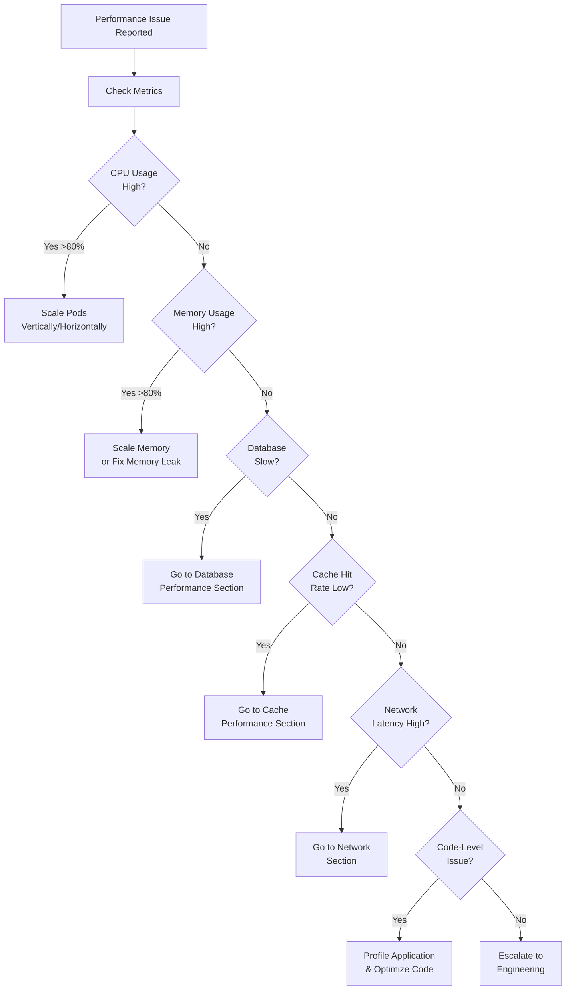

# Performance Degradation Runbook
_Audience: SRE + Platform Eng • Owner: SRE • Last verified: 2026-02-12_

This runbook provides step-by-step procedures for diagnosing and resolving performance degradation in the Mereka LMS platform.

## 🎯 When to Use This Runbook

Use this runbook when experiencing:
- Slow page loads (>5 seconds for LMS pages)
- Request timeouts (502/504 errors)
- High latency in API responses
- Increased error rates without full outage
- User complaints about system slowness

## 📊 Performance Decision Tree



## 🔍 Diagnostic Steps

### 1. Check System Metrics

```bash
# Check Prometheus metrics
kubectl port-forward -n mereka-lms svc/prometheus 9090:9090

# Open http://localhost:9090 and check:
# - container_cpu_usage_seconds_total
# - container_memory_working_set_bytes
# - http_request_duration_seconds
```

### 2. Check Pod Resource Usage

```bash
# CPU and memory usage by pod
kubectl top pods -n mereka-lms --sort-by=cpu
kubectl top pods -n mereka-lms --sort-by=memory

# Check for resource limits
kubectl describe pod -n mereka-lms -l app.kubernetes.io/name=lms | grep -A 5 "Limits:"
```

### 3. Check Application Logs

```bash
# Check for slow queries or errors
kubectl logs -n mereka-lms -l app.kubernetes.io/name=lms --tail=100 | grep -i "slow\|timeout\|error"

# Check Celery worker performance
kubectl logs -n mereka-lms -l app.kubernetes.io/name=lms-worker --tail=100
```

### 4. Check Database Performance

```bash
# MySQL slow query log
kubectl exec -n mereka-lms deployment/mysql -- mysql -u root -p$(kubectl get secret -n mereka-lms mysql -o jsonpath='{.data.MYSQL_ROOT_PASSWORD}' | base64 -d) \
  -e "SELECT * FROM mysql.slow_log ORDER BY query_time DESC LIMIT 10;"

# MongoDB Atlas performance (check via Atlas UI)
# https://cloud.mongodb.com/ → Performance tab
```

## 🛠️ Resolution Procedures

### CPU Performance Issues

**Symptoms:**
- `kubectl top pods` shows >80% CPU usage
- Prometheus shows high `container_cpu_usage_seconds_total`

**Resolution:**

```bash
# Option 1: Horizontal scaling (recommended)
kubectl scale deployment -n mereka-lms lms --replicas=3

# Option 2: Vertical scaling (requires restart)
kubectl set resources deployment -n mereka-lms lms \
  --limits=cpu=2000m,memory=4Gi \
  --requests=cpu=1000m,memory=2Gi

# Verify scaling
kubectl get pods -n mereka-lms -l app.kubernetes.io/name=lms
kubectl top pods -n mereka-lms -l app.kubernetes.io/name=lms
```

**When to scale:**
- Sustained >70% CPU for >5 minutes
- Request latency >2s P95
- Error rate >1%

### Memory Performance Issues

**Symptoms:**
- `kubectl top pods` shows >80% memory usage
- Pods restarting with OOMKilled status

**Resolution:**

```bash
# Check for memory leaks
kubectl logs -n mereka-lms -l app.kubernetes.io/name=lms --previous | grep -i "memory\|oom"

# Increase memory limits
kubectl set resources deployment -n mereka-lms lms \
  --limits=cpu=2000m,memory=6Gi \
  --requests=cpu=1000m,memory=3Gi

# If memory leak suspected, restart pods
kubectl rollout restart deployment -n mereka-lms lms
```

**When to investigate memory leaks:**
- Memory usage grows continuously over time
- Pods regularly restart with OOMKilled
- Memory usage doesn't stabilize after restart

### Database Performance Issues

**Symptoms:**
- Slow query log shows queries >1s
- High database CPU/memory usage
- Connection pool exhaustion

**Resolution:**

```bash
# 1. Identify slow queries
# For MySQL:
kubectl exec -n mereka-lms deployment/mysql -- mysql -u root -p$(kubectl get secret -n mereka-lms mysql -o jsonpath='{.data.MYSQL_ROOT_PASSWORD}' | base64 -d) \
  -e "SHOW FULL PROCESSLIST;"

# 2. Check connection pool status
kubectl logs -n mereka-lms -l app.kubernetes.io/name=lms | grep -i "pool\|connection"

# 3. Scale database (if using Cloud SQL)
# Use GCP Console to increase CPU/memory for Cloud SQL instance

# 4. Add indexes for slow queries (requires engineering)
# Document slow queries and escalate to engineering team
```

**When to scale database:**
- DB CPU >80% for >10 minutes
- Connection pool >90% utilized
- Query latency >500ms P95

### Cache Performance Issues

**Symptoms:**
- Low cache hit rate (<80%)
- High Redis CPU/memory usage
- Increased database load

**Resolution:**

```bash
# 1. Check Redis stats
kubectl exec -n mereka-lms deployment/redis -- redis-cli INFO stats | grep -i "hit\|miss"

# 2. Check Redis memory usage
kubectl exec -n mereka-lms deployment/redis -- redis-cli INFO memory

# 3. Increase Redis memory limit
kubectl set resources deployment -n mereka-lms redis \
  --limits=memory=2Gi \
  --requests=memory=1Gi

# 4. Clear cache if corruption suspected
kubectl exec -n mereka-lms deployment/redis -- redis-cli FLUSHALL
```

**When to clear cache:**
- Cache corruption suspected (inconsistent data)
- After major deployment (to avoid serving stale data)
- High eviction rate with available memory

### Network Performance Issues

**Symptoms:**
- High latency between services
- Packet loss
- DNS resolution slow

**Resolution:**

```bash
# 1. Test service-to-service latency
kubectl run curl-test --rm -i --image=curlimages/curl --restart=Never -n mereka-lms \
  -- sh -c "time curl -I http://lms:8000 && time curl -I http://mysql:3306"

# 2. Check network policies
kubectl get networkpolicies -n mereka-lms

# 3. Check service mesh (if using Istio/Linkerd)
# Not applicable for current setup

# 4. Check DNS resolution time
kubectl run dns-test --rm -i --image=busybox --restart=Never -n mereka-lms \
  -- sh -c "time nslookup lms.mereka-lms.svc.cluster.local"
```

## 📈 Performance Baselines

### Expected Performance Metrics

| Metric | Baseline | Warning | Critical |
|--------|----------|---------|----------|
| LMS Page Load (P95) | <2s | 2-5s | >5s |
| API Response Time (P95) | <500ms | 500ms-2s | >2s |
| Database Query Time (P95) | <100ms | 100ms-500ms | >500ms |
| Cache Hit Rate | >90% | 80-90% | <80% |
| CPU Usage (average) | <50% | 50-80% | >80% |
| Memory Usage (average) | <70% | 70-85% | >85% |
| Error Rate | <0.1% | 0.1-1% | >1% |

### Load Capacity

| Environment | Concurrent Users | Requests/sec | Notes |
|-------------|-----------------|--------------|-------|
| Development (Kind) | 10 | 5 | Single node, resource-limited |
| Production (GKE) | 1000 | 50 | Auto-scaled, 3-10 pods |

## 🔄 Scaling Procedures

### Horizontal Pod Autoscaling (HPA)

**Current status:** Not configured (manual scaling only)

**To enable HPA:**

```yaml
# File: deploy/k8s/base/apps/lms/hpa.yaml
apiVersion: autoscaling/v2
kind: HorizontalPodAutoscaler
metadata:
  name: lms
  namespace: mereka-lms
spec:
  scaleTargetRef:
    apiVersion: apps/v1
    kind: Deployment
    name: lms
  minReplicas: 2
  maxReplicas: 10
  metrics:
  - type: Resource
    resource:
      name: cpu
      target:
        type: Utilization
        averageUtilization: 70
  - type: Resource
    resource:
      name: memory
      target:
        type: Utilization
        averageUtilization: 80
```

### Manual Scaling

```bash
# Scale LMS pods
kubectl scale deployment -n mereka-lms lms --replicas=5

# Scale CMS pods
kubectl scale deployment -n mereka-lms cms --replicas=3

# Scale workers
kubectl scale deployment -n mereka-lms lms-worker --replicas=4
kubectl scale deployment -n mereka-lms cms-worker --replicas=2
```

### Vertical Scaling

```bash
# Increase resources for LMS
kubectl set resources deployment -n mereka-lms lms \
  --limits=cpu=4000m,memory=8Gi \
  --requests=cpu=2000m,memory=4Gi

# This triggers a rolling restart - monitor during the process
kubectl rollout status deployment -n mereka-lms lms
```

## 🚨 Escalation

### When to Escalate

Escalate to Engineering when:
- Performance degradation persists after scaling
- Root cause is unclear after diagnostics
- Code-level optimization needed
- Database schema changes required
- Memory leak confirmed

### Escalation Information to Provide

```bash
# 1. Collect metrics snapshot
kubectl top pods -n mereka-lms > /tmp/perf-issue-$(date +%Y%m%d-%H%M%S)-metrics.txt

# 2. Collect logs
kubectl logs -n mereka-lms -l app.kubernetes.io/name=lms --tail=1000 > /tmp/perf-issue-$(date +%Y%m%d-%H%M%S)-logs.txt

# 3. Collect resource definitions
kubectl get deployment -n mereka-lms lms -o yaml > /tmp/perf-issue-$(date +%Y%m%d-%H%M%S)-deployment.yaml

# 4. Attach to incident ticket
# Include: timeframe, symptoms, diagnostics performed, mitigation attempted
```

## 📚 Related Runbooks

- [Site Down Runbook](site-down.md) - For complete outages
- [Database Issues Runbook](database-issues.md) - For database-specific problems
- [Scaling Runbook](scaling.md) - Detailed scaling procedures
- [Disaster Recovery](DISASTER_RECOVERY.md) - For data recovery

## ✅ Verification

After resolution:

```bash
# 1. Check metrics returned to normal
kubectl top pods -n mereka-lms

# 2. Verify application response time
time curl -I https://academyv2.mereka.io

# 3. Check error rate
kubectl logs -n mereka-lms -l app.kubernetes.io/name=lms --tail=100 | grep -i error | wc -l

# 4. Monitor for 15 minutes to ensure stability
watch -n 30 'kubectl top pods -n mereka-lms'
```

Expected results:
- CPU usage <70%
- Memory usage <80%
- Response time <2s
- No errors in logs
- No pod restarts

## 📝 Post-Incident Actions

1. Document the incident in `docs/status/incidents/`
2. Update baseline metrics if capacity changed
3. Consider permanent scaling if temporary scaling was effective
4. Create Jira ticket for any code optimizations identified
5. Update this runbook with lessons learned
