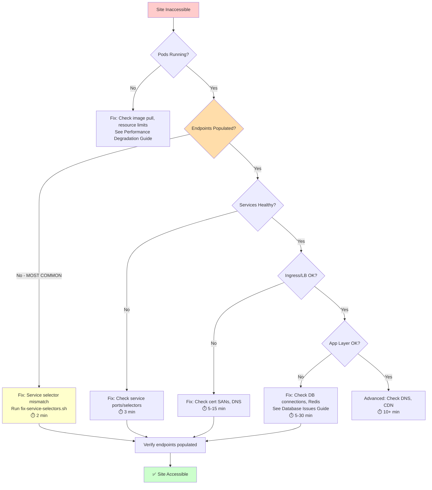
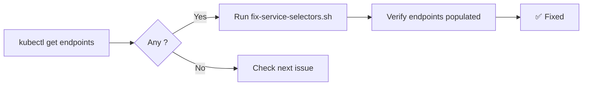

# Site Down Runbook
_Audience: Developers & Agents • Owner: SRE • Last verified: 2026-02-12_

Quick reference for diagnosing and fixing site downtime. Follow the decision tree below to isolate the issue quickly.

## 🔍 Decision Tree (Start Here)



**Timing Key**: Total diagnostic time: **5-10 minutes** for most common issues (selector mismatches)

**Related Runbooks**:
- [Performance Degradation](performance-degradation.md) - Slow responses, high latency
- [Database Issues](database-issues.md) - MySQL/MongoDB connection failures
- Certificate Issues (no dedicated runbook; see [INCIDENT_RESPONSE.md](INCIDENT_RESPONSE.md) TLS section) - TLS/SSL problems

---

## 🚨 Quick Diagnostic Checklist (5 Commands, 2 Minutes)

When the site is inaccessible, run these commands in order:

```bash
# Step 1: Check if pods are running (⏱️ 10 seconds)
kubectl get pods -n mereka-lms

# Step 2: Check service endpoints (⏱️ 10 seconds)
# CRITICAL: Empty endpoints (<none>) = #1 cause of downtime
kubectl get endpoints -n mereka-lms

# Step 3: Check service selectors match pod labels (⏱️ 20 seconds)
kubectl get svc -n mereka-lms -o jsonpath='{range .items[*]}{.metadata.name}{"\t"}{.spec.selector}{"\n"}{end}'
kubectl get pods -n mereka-lms -l app.kubernetes.io/name=lms --show-labels | head -1

# Step 4: Check LoadBalancer status (⏱️ 10 seconds)
kubectl get svc caddy -n mereka-lms

# Step 5: Test internal connectivity (⏱️ 30 seconds)
kubectl run curl-test --rm -i --image=curlimages/curl --restart=Never -n mereka-lms -- curl -I http://lms:8000
```

**Expected Results**:
- Step 1: All pods `Running` or `Completed`
- Step 2: All services have IP:Port endpoints (NOT `<none>`)
- Step 3: Service selectors match pod labels (same instance ID)
- Step 4: LoadBalancer has `EXTERNAL-IP` (not `<pending>`)
- Step 5: Internal curl returns `HTTP/1.1 200` or `302`

**If Step 2 shows `<none>`**: Jump to [Issue 1: Service Has No Endpoints](#issue-1-service-has-no-endpoints-none) (2-minute fix)

---

## 📊 Issue Frequency & Impact

| Issue | Frequency | MTTR | Impact | Related Runbook |
|-------|-----------|------|--------|-----------------|
| Service selector mismatch | 70% | 2 min | Total outage | This guide |
| HTTPS port missing on Caddy | 10% | 15 min (LB propagation) | HTTPS-only outage | [Issue 4](#issue-4-https-port-missing-on-caddy--15-min-lb-propagation) |
| Database connection failures | 10% | 5-30 min | Total outage | [Database Issues](database-issues.md) |
| Redis host drift | 5% | 5 min | Slow/hanging requests | [Performance Degradation](performance-degradation.md) |
| Other (DNS, CDN, app bugs) | 5% | Variable | Variable | Various |

**Key Insight**: 70% of site downtime is caused by selector mismatches. Always check endpoints first.

---

## 🔧 Common Issues & Fixes

### Issue 1: Service Has No Endpoints (`<none>`) ⏱️ 2 MIN

**Symptoms:**
- `kubectl get endpoints` shows `<none>` for a service
- Site returns 502/503/504 errors
- Pods are running (`kubectl get pods`) but site is inaccessible

**Root Cause:**
Service selector doesn't match pod labels. This happens when:
- Pods are restarted/recreated with new instance IDs
- Tutor regenerates configs with different instance IDs
- Manual pod deletions/recreations

**Diagnosis Flowchart:**


**Quick Fix:**
```bash
# 1. Get current pod instance ID
POD_INSTANCE=$(kubectl get pods -n mereka-lms -l app.kubernetes.io/name=lms -o jsonpath='{.items[0].metadata.labels.app\.kubernetes\.io/instance}')

# 2. Get service selector instance ID
SVC_INSTANCE=$(kubectl get svc lms -n mereka-lms -o jsonpath='{.spec.selector.app\.kubernetes\.io/instance}')

# 3. If they don't match, update the service
if [ "$POD_INSTANCE" != "$SVC_INSTANCE" ]; then
  kubectl get svc lms -n mereka-lms -o yaml > /tmp/lms-svc.yaml
  sed -i.bak "s/$SVC_INSTANCE/$POD_INSTANCE/g" /tmp/lms-svc.yaml
  kubectl apply -f /tmp/lms-svc.yaml
  echo "✓ Fixed LMS service selector"
fi
```

**Bulk Fix Script:**
```bash
# Fix all services at once
for svc in lms cms caddy nginx discovery ecommerce notes xqueue; do
  POD_INSTANCE=$(kubectl get pods -n mereka-lms -l app.kubernetes.io/name=$svc -o jsonpath='{.items[0].metadata.labels.app\.kubernetes\.io/instance}' 2>/dev/null)
  if [ -n "$POD_INSTANCE" ]; then
    kubectl get svc $svc -n mereka-lms -o yaml > /tmp/${svc}-svc.yaml
    OLD_INSTANCE=$(grep -o 'openedx-[^"]*' /tmp/${svc}-svc.yaml | head -1)
    if [ "$OLD_INSTANCE" != "$POD_INSTANCE" ] && [ -n "$OLD_INSTANCE" ]; then
      sed -i.bak "s/$OLD_INSTANCE/$POD_INSTANCE/g" /tmp/${svc}-svc.yaml
      kubectl apply -f /tmp/${svc}-svc.yaml && echo "✓ Fixed $svc"
    fi
  fi
done
```

**See Also**:
- [Performance Degradation](performance-degradation.md) - If endpoints exist but responses are slow
- [Database Issues](database-issues.md) - If pods are CrashLooping

---

### Issue 2: Nginx Upstream Timeout ⏱️ 3 MIN

**Symptoms:**
- Nginx logs show: `upstream timed out` or `upstream prematurely closed connection`
- Nginx can't reach backend services (LMS, CMS, etc.)
- Site returns 502/504 errors

**Root Cause:**
- DNS resolution failing in nginx (`lms:8000` times out)
- Service IP changed but nginx config still uses DNS name

**Quick Fix:**
```bash
# Option 1: Use service ClusterIP directly (more reliable)
SVC_IP=$(kubectl get svc lms -n mereka-lms -o jsonpath='{.spec.clusterIP}')
kubectl get configmap nginx-config-hbdc8f9mfd -n mereka-lms -o yaml > /tmp/nginx-config.yaml
sed -i.bak "s/server lms:8000/server $SVC_IP:8000/g" /tmp/nginx-config.yaml
kubectl apply -f /tmp/nginx-config.yaml
kubectl delete pod -n mereka-lms -l app.kubernetes.io/name=nginx

# Option 2: Restart nginx to refresh DNS cache
kubectl delete pod -n mereka-lms -l app.kubernetes.io/name=nginx
```

**Common Pitfall**: Don't restart nginx first - always verify backend endpoints are populated

---

### Issue 3: LoadBalancer Connection Refused ⏱️ 3 MIN

**Symptoms:**
- External access fails: `Connection refused`
- LoadBalancer IP exists but no traffic reaches pods
- `kubectl get endpoints caddy` shows `<none>`

**Root Cause:**
Caddy service selector mismatch (same as Issue 1, but affects external access)

**Quick Fix:**
```bash
# Fix Caddy service selector
POD_INSTANCE=$(kubectl get pods -n mereka-lms -l app.kubernetes.io/name=caddy -o jsonpath='{.items[0].metadata.labels.app\.kubernetes\.io/instance}')
kubectl get svc caddy -n mereka-lms -o yaml > /tmp/caddy-svc.yaml
sed -i.bak "s/openedx-[^/]*/$POD_INSTANCE/g" /tmp/caddy-svc.yaml
kubectl apply -f /tmp/caddy-svc.yaml
sleep 3 && kubectl get endpoints caddy -n mereka-lms
```

**See Also**: [Issue 1](#issue-1-service-has-no-endpoints-none) - Caddy endpoint issues have the same root cause

---

### Issue 4: HTTPS Port Missing on Caddy ⏱️ 15 MIN (LB propagation)

**Symptoms:**
- HTTP works but HTTPS (`https://academyv2.mereka.io` or LB IP on 443) times out
- `kubectl get svc caddy -n mereka-lms -o jsonpath='{.spec.ports[*].port}'` shows only `80`

**Root Cause:**
- Caddy Service was created without port 443. The GCP LoadBalancer never opens TLS, so all HTTPS requests fail.

**Related Issues**:
- See [Issue 4b: Fake Ingress Certificate](#issue-4b-fake-ingress-certificate-10-30-min) - For fake certificate or TLS handshake errors

**Quick Fix:**
```bash
# Add port 443 to caddy service (idempotent if 443 is missing)
kubectl patch svc caddy -n mereka-lms --type='json' \
  -p='[{"op": "add", "path": "/spec/ports/-", "value": {"name": "https", "port": 443, "protocol": "TCP", "targetPort": 443}}]'

# Verify ports now include 80 and 443
kubectl get svc caddy -n mereka-lms -o jsonpath='{.spec.ports[*].port}'

# Wait 5-15 minutes for GCP LB propagation, then test:
curl -Ik https://academyv2.mereka.io
```

**One-command repair (selectors + HTTPS):**
```bash
./scripts/infra/repair-routing.sh
```

---

### Issue 4b: Fake Ingress Certificate ⏱️ 10-30 MIN

**Symptoms:**
- TLS cert shows `Kubernetes Ingress Controller Fake Certificate`
- Browser warns about invalid certificate on `academyv2.mereka.io`

**Root Cause:**
- DNS points at the wrong LoadBalancer IP, or
- The Ingress/Certificate SAN list does not include the hostname

**Quick Fix:**
```bash
# 1) Validate cert SANs
./scripts/infra/check-cert-sans.sh

# 2) Confirm Ingress hosts + certs include the domain
kubectl get ingress openedx-lms -n mereka-lms
kubectl get certificate openedx-lms-tls -n mereka-lms -o jsonpath='{.spec.dnsNames}'

# 3) Ensure DNS is pointing at the Ingress LoadBalancer IP
kubectl get ingress openedx-lms -n mereka-lms -o jsonpath='{.status.loadBalancer.ingress[0].ip}'
./scripts/infra/cloudflare-sync.sh  # records.json should target the ingress IP

# 4) Verify live certificate (should be Let's Encrypt)
echo | openssl s_client -servername academyv2.mereka.io -connect academyv2.mereka.io:443 2>/dev/null | \
  openssl x509 -noout -subject -issuer
```

**Notes:**
- If the fake cert persists, confirm:
  - The hostname appears on an Ingress in `mereka-lms` (use `./scripts/qa/list-openedx-hostnames.sh`), and
  - The matching `Certificate` includes the hostname in `spec.dnsNames`.
- Production is GitOps-managed; Ingress/Certificate changes must land in:
  - `BBI-K8/apps/mereka-lms/overlays/prod/patches/*` (older docs may still say `infrastructure`)
- When enabling new services (credentials/forum), add/update DNS records in `infrastructure/cloudflare/records*.json` and re-run `./scripts/infra/cloudflare-sync.sh`.
- Re-run `./scripts/infra/repair-routing.sh` after any selector drift.

**See Also**: [Issue 4b: Fake Ingress Certificate](#issue-4b-fake-ingress-certificate-10-30-min) - Comprehensive TLS troubleshooting

---

### Issue 4c: Studio "Servers Encountered an Error" (MongoDB SRV) ⏱️ 30 MIN (rebuild required)

**Symptoms:**
- Studio shows “The Studio servers encountered an error”
- `cms` logs show: `pymongo.errors.ConfigurationError: The "dnspython" module must be installed to use mongodb+srv:// URIs`

**Root Cause:**
- Open edX image is missing `dnspython`, required for MongoDB Atlas SRV URIs

**Fix (Permanent):**
```bash
# 1) Ensure build patches install pymongo SRV extras
rg -n "pymongo\\[srv\\]" infrastructure/tutor/apply-patches.sh

# 2) Re-apply patches and rebuild image
./infrastructure/tutor/apply-patches.sh
source .venv/bin/activate
export TUTOR_ROOT="$(pwd)/tutor_env"
tutor images build openedx

# 3) Push + update deployments (GKE)
docker tag tutor_local/openedx:latest ghcr.io/biji-biji-initiative/mereka-lms/openedx:TAG
docker push ghcr.io/biji-biji-initiative/mereka-lms/openedx:TAG
kubectl set image deployment/cms cms=ghcr.io/biji-biji-initiative/mereka-lms/openedx:TAG -n mereka-lms
kubectl rollout status deployment/cms -n mereka-lms
```

**See Also**: [Database Issues Runbook](database-issues.md) - MongoDB connection troubleshooting

---

### Issue 4d: LMS/CMS MySQL `1045 Access denied` (Trailing Newline In Secret) ⏱️ 5 MIN

**Symptoms:**
- LMS/CMS logs show: `MySQLdb.OperationalError: (1045, "Access denied for user 'openedx'@'10.x.x.x' (using password: YES)")`
- `manage.py lms shell -c ...` fails, even when the site still serves `200` for some pages

**Root Cause:**
- `OPENEDX_MYSQL_PASSWORD` was injected with a trailing newline (`\\n`) from the secret store (Infisical/GCP Secret Manager/ESO).
- The MySQL user password in the database does not include that newline, so auth fails.

**How to Confirm (no secret value printed):**
```bash
kubectl exec -n mereka-lms deploy/lms -- python - <<'PY'
import os
pw = os.environ.get("OPENEDX_MYSQL_PASSWORD", "")
print("len", len(pw))
print("endswith_newline", pw.endswith("\\n"))
print("endswith_cr", pw.endswith("\\r"))
PY
```

**Fix (Permanent):**
- The Open edX K8s settings templates strip trailing CR/LF before assigning the DB password:
  - `deploy/k8s/base/apps/openedx/settings/lms/production.py`
  - `deploy/k8s/base/apps/openedx/settings/cms/production.py`

Apply the overlay and restart LMS/CMS so the updated settings configmaps are mounted:
```bash
kubectl apply -k deploy/k8s/overlays/production
kubectl rollout restart -n mereka-lms deploy/lms deploy/lms-worker deploy/cms deploy/cms-worker
```

**Follow-up (recommended):**
- Normalize the upstream secret values to remove trailing newlines so other services don't hit the same edge case.
- Use `scripts/infra/infisical-audit-mereka-lms.sh` to detect newline drift without printing values.
- Use `scripts/infra/infisical-validate-mereka-lms.sh` as a pre-flight gate (set `STRICT=1` to fail on trailing CR/LF).

**See Also**: [Database Issues Runbook](database-issues.md) - MySQL authentication and connection troubleshooting

---

### Issue 4e: Notes/XQueue MySQL Failures (DB/User Missing or Env Missing) ⏱️ 10 MIN

**Symptoms:**
- Notes and/or XQueue endpoints exist but error when they actually hit the DB
- XQueue migrate/connect fails with: `Access denied ... (using password: NO)`
- MySQL does not list `notes` / `xqueue` databases or users

**Root Causes (common):**
1. MySQL DBs/users for optional services were never created (`notes`, `xqueue`)
2. XQueue deployment was missing `envFrom` for `database-secrets` (no DB password injected)

**How to Confirm (no secrets printed):**
```bash
# DB presence
kubectl exec -n mereka-lms deploy/mysql -- sh -lc 'env MYSQL_PWD=\"$MYSQL_ROOT_PASSWORD\" mysql -uroot -h mysql -e \"SHOW DATABASES;\"'

# XQueue has DB secrets injected (should show envFrom entries > 0)
kubectl get deploy/xqueue -n mereka-lms -o json | jq -r '.spec.template.spec.containers[] | [.name,(.envFrom|length)] | @tsv'
```

**Fix (non-destructive, idempotent):**
```bash
# Creates DBs + users for notes/xqueue and aligns their passwords to K8s secret values
./scripts/infra/provision-mysql-app-dbs.sh

# Ensure new env vars/config are picked up (if changed)
kubectl rollout restart -n mereka-lms deploy/notes deploy/xqueue
```

**Optional: Run migrations (requires venv python inside containers):**
```bash
kubectl exec -n mereka-lms deploy/notes -- sh -lc 'cd /app/edx-notes-api && /app/venv/bin/python manage.py migrate --noinput'
kubectl exec -n mereka-lms deploy/xqueue -- sh -lc 'cd /openedx/xqueue && /openedx/venv/bin/python manage.py migrate --noinput'
```

**See Also**: [Database Issues Runbook](database-issues.md) - Provisioning databases for services

---

### Issue 5: Account Settings/Profile Pages Blank or Stuck ⏱️ 5-15 MIN

**Symptoms:**
- `/account/settings` or `/u/<user>` loads header/footer only
- Console errors: `Script error for "gettext"`
- 404 for `/static/js/i18n/<lang>/djangojs.js`

**Root Cause (most common now):**
Account/profile pages are still using legacy LMS templates instead of the MFEs.
The MFEs are healthy, but the redirect flags/config are not enabled. Stale
cookies can produce the same symptoms—test in a fresh browser profile first.

**Preferred Fix (redirect to MFEs):**
```bash
	kubectl exec -n mereka-lms deploy/lms -- /bin/bash -c \
	  "cd /openedx/edx-platform && ./manage.py lms shell -c \
	  \"from openedx.core.djangoapps.site_configuration.models import SiteConfiguration; \
	from waffle.models import Flag; \
	domains=['academyv2.mereka.io','academy.biji-biji.com','skillourfuture.academy.mereka.io']; \
	# NOTE: `skillourfuture.academyv2.mereka.io` is not a canonical hostname today.
	# The Skill Our Future microsite uses `skillourfuture.academy.mereka.io`.
	# If you introduce a new alias under `*.academyv2.mereka.io`, you must also:
	# - add DNS + Ingress + TLS SAN coverage
	# - ensure Authentik OIDC redirect_uri allowlist includes that host
	# - update the hostname registry (`docs/reference/operations/OPENEDX_HOSTNAMES.md`)
	for domain in domains: \
	    site = SiteConfiguration.objects.filter(site__domain=domain).first(); \
	    values = dict(site.site_values); \
	    values['ENABLE_ACCOUNT_MICROFRONTEND'] = True; \
	    values['ENABLE_PROFILE_MICROFRONTEND'] = True; \
    site.site_values = values; site.save(); \
for name in ['account.redirect_to_microfrontend','learner_profile.redirect_to_microfrontend']: \
    Flag.objects.update_or_create(name=name, defaults={'everyone': True}); \
\""
```

**Legacy Fix (if you must keep LMS pages):**
`compilejsi18n` was not run for LMS/CMS, so translated JS bundles are missing.

**Quick Fix (in running pods):**
```bash
./scripts/infra/refresh-i18n-static.sh

# Or run manually:
kubectl exec -n mereka-lms deploy/lms -- /bin/bash -c \
  "cd /openedx/edx-platform && ./manage.py lms compilejsi18n --output /openedx/staticfiles/js/i18n"

kubectl exec -n mereka-lms deploy/cms -- /bin/bash -c \
  "cd /openedx/edx-platform && ./manage.py cms compilejsi18n --output /openedx/staticfiles/studio/js/i18n"
```

**Permanent Fix:**
- Ensure the Open edX image build runs `compilejsi18n` (or `collectstatic` pipeline includes it).
- Rebuild and redeploy the image after theme changes.

**Common Pitfall**: Always test in a fresh browser profile first - stale cookies can mimic config issues

---

### Issue 6: Studio "New Course" Disabled ⏱️ 2 MIN

**Symptoms:**
- “New Course” opens but “Create” stays disabled
- No console errors
- User is staff/superuser but still can’t create

**Root Cause:**
User lacks a `CourseCreator` record with `state=granted`.

**If the modal still no-ops and console shows 403 AJAX errors:**
- CMS cookies/CSRF may not be scoped to `.academyv2.mereka.io`.
- Ensure `SESSION_COOKIE_DOMAIN` and `CSRF_COOKIE_DOMAIN` are set in
  `deploy/k8s/base/apps/openedx/settings/cms/production.py`, then rebuild
  and redeploy the Open edX image.

**Fix:**
```bash
kubectl exec -n mereka-lms deploy/cms -- /bin/bash -c \
  "cd /openedx/edx-platform && ./manage.py cms shell -c \
  \"from django.contrib.auth import get_user_model; \
from cms.djangoapps.course_creators.models import CourseCreator; \
u=get_user_model().objects.get(email='gurpreet@biji-biji.com'); \
qs=CourseCreator.objects.filter(user=u); \
(qs.update(state=CourseCreator.GRANTED, all_organizations=True) if qs.exists() \
else CourseCreator.objects.bulk_create([CourseCreator(user=u, state=CourseCreator.GRANTED, all_organizations=True)]));\""
```

**See Also**: Authentication issues can also cause Studio problems - see [Issue 7 series](#issue-7-login-fails-csrf-403-or-500-on-login_session)

---

### Issue 6a: Kind Dev ImagePullBackOff (OpenedX images) ⏱️ 10 MIN

**Symptoms:**
- `lms/cms` pods stuck in `ImagePullBackOff` on `kind-dev`
- Images are private (`asia-southeast1-docker.pkg.dev/...`)

**Root Cause:**
Kind nodes do not have Artifact Registry credentials by default.

**Fix:**
```bash
# One command end-to-end (loads image, applies overlay, verifies health+branding)
./scripts/infra/apply-kind-overlay.sh

# Or, if you only need to load the image into kind nodes (cluster name = dev):
./scripts/infra/kind-load-openedx-image.sh
```

**Notes:**
- Keep the dev tag aligned with production (`deploy/k8s/base/kustomization.yaml`).
- If the tag changes, re-run `./scripts/infra/kind-load-openedx-image.sh` (it infers the tag from the overlay).

---

### Issue 6b: Tutor Build No-Op / Fast-Fail (`Project root does not exist`)

**Symptoms:**
- `tutor images build openedx` exits immediately with:
  `Project root does not exist. Make sure to generate the initial configuration...`
- Subsequent rollout still serves old image/tag.

**Root Cause:**
- `TUTOR_ROOT` was not exported in the active shell before running Tutor commands.

**Fix:**
```bash
cd /home/gurpreet/projects/k8s/mereka-lms
source .venv/bin/activate
export TUTOR_ROOT="$(pwd)/tutor_env"
tutor images build openedx
```

**Operator rule:**
- Treat every Tutor command as invalid unless `echo "$TUTOR_ROOT"` resolves to this repo’s `tutor_env`.

---

### Issue 6c: Argo `ComparisonError` (`not our ref`) after GitOps bump

**Symptoms:**
- Argo app shows `ComparisonError` with:
  `fatal: remote error: upload-pack: not our ref <sha>`
- App stays out of sync even though manifests were pushed.

**Root Cause:**
- Wrong commit SHA pinned in:
  `BBI-K8/apps/mereka-lms/base/kustomization.yaml`

**Fix:**
```bash
# source SHA must come from mereka-lms repo
git -C /home/gurpreet/projects/k8s/mereka-lms rev-parse HEAD

# update pinned ref in BBI-K8 (active GitOps repo) and push
# then force Argo refresh for app:
kubectl --context gke_bbi-k8_asia-southeast1-c_bbi-k8-cluster \
  -n argocd annotate application mereka-lms-local \
  argocd.argoproj.io/refresh=hard --overwrite
```

**Operator rule:**
- Never hand-type long `?ref=` SHAs; always paste exact `git rev-parse HEAD` output.

---

### Issue 7: No Courses Visible / Modulestore Permission Errors ⏱️ 5-30 MIN

**Symptoms:**
- `CourseOverview.objects.count()` returns 0
- CMS/LMS errors referencing modulestore access, e.g.:
  - `user is not allowed to do action [find] on [openedx.modulestore]`
  - `pymongo.errors.*` connection/config errors

**Root Cause (depends on modulestore backend):**
- If modulestore is using **Atlas**: the Atlas DB user may not have `readWrite` on `openedx`.
- If modulestore is using **in-cluster MongoDB**: service endpoints/selectors may be broken, or MongoDB is down.
- If modulestore has courses but `CourseOverview` is still 0: MySQL course indexes may be missing; this is a recovery/import problem.

**Step 0: Determine modulestore backend (Atlas vs in-cluster)**
```bash
kubectl exec -n mereka-lms deploy/lms -- python /openedx/edx-platform/manage.py lms shell -c \
"from django.conf import settings; \
cfg=settings.CONTENTSTORE.get('DOC_STORE_CONFIG', {}); \
print('DOC_STORE_HOST', cfg.get('host')); \
print('DOC_STORE_DB', cfg.get('db'));"
```

**Fix (if modulestore uses Atlas)**
1. Follow `docs/ops/runbooks/MONGODB_PERMISSIONS_ISSUE.md` to grant `readWrite@openedx`.
2. Confirm the secret mappings are correct (Infisical -> GCP -> ESO -> `openedx-secrets`).
3. Restart `lms/cms` to pick up config/secret changes.

**Fix (if modulestore uses in-cluster MongoDB)**
1. Check endpoints: `kubectl get endpoints mongodb -n mereka-lms`
2. If endpoints are empty, patch selector as documented in the "MongoDB exception" section below.
3. Verify CMS logs after restart.

**Fix (if `CourseOverview` is 0)**
See `docs/ops/runbooks/COURSE_DATA_RECOVERY.md` (this is usually import/restore work, not an auth issue).

**See Also**: [Database Issues Runbook](database-issues.md) - MongoDB Atlas connectivity and permissions

**Fix (Dev kind):**
```bash
./infrastructure/tutor/apply-patches.sh
tutor images build openedx
kubectl rollout restart deployment/cms -n mereka-lms
```

---

### Issue 4d: Forum Heartbeat 502 (Atlas Allowlist) ⏱️ 5-15 MIN

**Symptoms:**
- `https://forum.academyv2.mereka.dev/heartbeat` returns 502 (dev)
- `forum` pod logs show MongoDB connection failures

**Most common root causes:**
1. **Dev is accidentally pointing to Atlas SRV.** The forum container generates a `mongoid.yml`
   from env vars; SRV-style values and/or unquoted special characters can cause `Psych::SyntaxError`
   and crashloop.
2. **Atlas allowlist drift.** MongoDB Atlas is on **public IP allowlists**; the VPS egress IP is
   missing from the allowlist.

**Preferred fix (kind dev): use in-cluster MongoDB**
Dev defaults to using the in-cluster `mongodb` service (no auth, no TLS) via the local overlay
`infrastructure/tutor` no longer uses a separate forum-dev patch; local overlay behavior is controlled by `deploy/k8s/overlays/local/kustomization.yaml` and image wiring in local manifests.

```bash
kubectl apply -k deploy/k8s/overlays/local --context kind-dev
kubectl rollout restart deployment/forum -n mereka-lms --context kind-dev
curl -I https://forum.academyv2.mereka.dev/heartbeat
```

**Quick Fix:**
```bash
# From VPS (dev) host — IPv4 only (Atlas doesn't accept IPv6)
VPS_IP=$(curl -s -4 https://ifconfig.me || curl -s https://api.ipify.org)

# Add to Atlas allowlist (requires atlas CLI login)
atlas projects list --output json | jq -r '.results[] | [.name,.id] | @tsv'
atlas accessLists create "$VPS_IP" --projectId <atlas-project-id>

# Optional: verify allowlist drift
EGRESS_IPS="$VPS_IP" ./scripts/infra/check-atlas-allowlist.sh
```

**Automation (preferred):**
```bash
./scripts/infra/monitor-atlas-allowlist-vps.sh
./scripts/infra/setup-vps-atlas-allowlist-cron.sh
```

For non-interactive automation, use API-key profile bootstrap:
```bash
REFRESH_ATLAS_PROFILE=1 ATLAS_PROFILE=mereka-lms ./scripts/infra/check-atlas-allowlist-vps.sh
```

**Verify:**
```bash
curl -I https://forum.academyv2.mereka.dev/heartbeat
kubectl logs -n mereka-lms deploy/forum --tail=100
```

---

### Issue 4c: Credentials Service 500 on `/` (Missing SiteConfiguration)

**Symptoms:**
- `https://credentials.academyv2.mereka.io/` returns 500
- Logs show `Site has no siteconfiguration`

**Root Cause:**
- Django Sites entry exists, but the `SiteConfiguration` row was never created for the credentials service.

**Quick Fix:**
```bash
kubectl exec -n mereka-lms deploy/credentials -- ./manage.py shell -c '
from django.contrib.sites.models import Site
from credentials.apps.core.models import SiteConfiguration
site, _ = Site.objects.get_or_create(id=1)
site.domain = "credentials.academyv2.mereka.io"
site.name = "Mereka Credentials"
site.save()
SiteConfiguration.objects.get_or_create(
  site=site,
  defaults={
    "platform_name": "Mereka Academy",
    "lms_url_root": "https://academyv2.mereka.io",
    "homepage_url": "https://academyv2.mereka.io",
  },
)
'
```

**Verify:**
```bash
curl -I https://credentials.academyv2.mereka.io/
```

**See Also**: [Database Issues Runbook](database-issues.md) - MongoDB Atlas troubleshooting

---

### Issue 5: Redis Host Drift (Requests Hang) ⏱️ 5 MIN

**Symptoms:**
- Pods healthy, selectors correct, but LMS/Studio requests time out or nginx reports 499.
- Internal curl to `http://lms:8000/` hangs; DB/Redis endpoints are up.
- Rendered configmaps show `redis://@10.x.x.x:6379` instead of the service DNS.

**Root Cause:**
- The rendered Open edX configmap (`openedx-config-*.json`) was baked with an old Redis IP. When Redis moves or the IP is wrong, Django cache/celery calls block, hanging every request.

**Quick Fix:**
```bash
# Patch configmap to use the Redis service DNS
kubectl get cm openedx-config-5t8bdcb64h -n mereka-lms -o yaml \
  | sed 's/10\\.[0-9]\\+\\.[0-9]\\+\\.[0-9]\\+:6379/redis:6379/g' \
  | kubectl apply -f -

# Restart frontends to pick up the fix
kubectl rollout restart deploy/lms deploy/cms -n mereka-lms
```

**Prevention:**
- Ensure Tutor/Terraform overrides keep `REDIS_HOST=redis` before regenerating configs.
- After `tutor k8s start` or config regenerations, spot-check `openedx-config-*.json` for `redis:6379`.

**See Also**: [Performance Degradation Runbook](performance-degradation.md) - Redis-related slow responses

---

### Issue 6: MySQL Has No Endpoints (In-Cluster) ⏱️ 5 MIN

**Symptoms:**
- `kubectl get endpoints mysql -n mereka-lms` shows `<none>`
- LMS/CMS hang or timeout on DB queries

**Root Cause (current production reality):**
- MySQL is **in-cluster**. Empty endpoints usually means the **mysql pod is not Ready** or selectors/labels drifted.

**Quick Fix:**
```bash
# Confirm pod exists + readiness
kubectl get pods -n mereka-lms -l app=mysql
kubectl describe deploy/mysql -n mereka-lms | sed -n '1,120p'

# Confirm endpoints and selector
kubectl get svc mysql -n mereka-lms -o jsonpath='{.spec.selector}{"\n"}'
kubectl get endpoints mysql -n mereka-lms

# Restart mysql deployment (safe, but expect brief DB downtime)
kubectl rollout restart deploy/mysql -n mereka-lms
kubectl rollout status deploy/mysql -n mereka-lms
kubectl get endpoints mysql -n mereka-lms
```

**Storage sanity:**
```bash
kubectl get pvc -n mereka-lms | rg '^mysql\\s'
```

**Prevention:**
- Keep selectors stable (see [Issue 1](#issue-1-service-has-no-endpoints-none) and `scripts/infra/fix-service-selectors.sh`).
- Add PVC disk utilization alerting for `mysql` before it fills (see `docs/status/active/OBSERVABILITY_ENHANCEMENT_PLAN.md`).

**See Also**: [Database Issues Runbook](database-issues.md) - MySQL troubleshooting and recovery

---

### Issue 7: Login Fails (CSRF 403 or 500 on login_session) ⏱️ 10 MIN

**Symptoms:**
- Login POST `/api/user/v1/account/login_session/` returns 403 CSRF (referer check failed) or 500 `json.decoder.JSONDecodeError`.
- Classic LMS login page in use (Auth MFE not enabled).

**Root Cause:**
- Missing CSRF trusted origins/cookie domains for custom hostnames (`academy.biji-biji.com`, `skillourfuture.academy.mereka.io`, etc.), or a user profile with corrupt `meta` JSON.

**Quick Fix:**
```bash
# Prefer the safe, deterministic route: verify multisite + hostnames first.
STRICT=1 ./scripts/qa/verify-multisite-config.sh prod

# If you must hotfix a rendered configmap in an outage, do it generically (no hardcoded cm name).
cm="$(kubectl get cm -n mereka-lms | awk '/^openedx-config-/{print $1; exit}')"
kubectl get cm "$cm" -n mereka-lms -o yaml \
  | sed -E 's#"CSRF_TRUSTED_ORIGINS": \\[.*\\]#"CSRF_TRUSTED_ORIGINS": ["https://academyv2.mereka.io","https://studio.academyv2.mereka.io","https://apps.academyv2.mereka.io","https://academy.biji-biji.com","https://skillourfuture.academy.mereka.io"]#' \
  | kubectl apply -f -
kubectl rollout restart deploy/lms deploy/cms -n mereka-lms

# If a specific user still errors with JSONDecodeError on login, reset profile.meta (do not reset passwords in docs).
kubectl exec -n mereka-lms deploy/lms -- bash -lc '
cd /openedx/edx-platform && ./manage.py lms shell --settings=tutor.production -c "
from django.contrib.auth import get_user_model
U=get_user_model()
u=U.objects.filter(email=\\"user@example.com\\").first() or U.objects.filter(username=\\"user@example.com\\").first()
assert u, \\"user not found\\"
p=u.profile
p.meta=\\"{}\\"
p.save()
print(\\"profile.meta reset\\", u.email or u.username)
"'
```

**Prevention:**
- Keep the trusted origins list in sync with all served hostnames (academyv2, studio, apps, academy.biji-biji.com, skillourfuture.*).
- Avoid corrupting `profile.meta`; if corruption occurs, set it back to `{}`.

---

### Issue 7a: Authentik login returns, but user is not signed in (`Session value state missing`)

**Symptoms:**
- Authentik login completes and returns to LMS, but session is not established.
- LMS logs include `Session value state missing` during `/auth/complete/oidc/`.
- `/auth/login/oidc/` response sets `sessionid` without the expected `Domain=...`.

**Root Cause:**
- Cookie-domain rewrite middleware (`MerekaCookieDomainMiddleware`) runs too early in response order.
- Session middleware sets OIDC state cookie after that, so the cookie can remain host-only and fail callback validation.

**Quick Verify:**
```bash
# Runtime signal in LMS logs:
kubectl -n mereka-lms logs deploy/lms --since=6h | rg -n "Session value state missing|auth/complete/oidc"

# Public header check (prod host example):
curl -sS -D - -o /dev/null https://academyv2.mereka.io/auth/login/oidc/ | rg -i '^set-cookie: sessionid='
# Expected: includes "Domain=.academyv2.mereka.io"
```

**Fix:**
```bash
# Verify repository guardrails first:
./scripts/qa/verify-oidc-cookie-middleware-order.sh

# Ensure lms/cms production settings keep cookie middleware before SessionMiddleware
# in request order (so it runs after SessionMiddleware in response order), then
# redeploy config and restart lms/cms.
kubectl rollout restart deployment/lms deployment/cms -n mereka-lms
```

**Prevention:**
- `scripts/qa/verify-auth-hardening.sh` and `scripts/qa/audit-auth-access.sh` include this guard.
- `scripts/qa/verify-auth-surfaces.sh` validates OIDC session cookie domain on public hosts.

---

### Issue 7a2: Studio SSO loops or 500s at `/complete/edx-oauth2/` (`Session value state missing`)

**Symptoms:**
- Studio login page shows Sign In, Authentik flow appears to complete, but you are not signed in to Studio.
- Studio may bounce back to `/login/edx-oauth2/` repeatedly.
- CMS logs include one of:
  - `social_core.exceptions.AuthStateMissing: Session value state missing`
  - `Internal Server Error: /complete/edx-oauth2/`
- The Studio home page HTML contains links like:
  - `/login/?next=http%3A%2F%2Fstudio.<domain>%2F`

**Root Cause:**
- Proxy forwarded-proto drift causes Django to treat HTTPS requests as HTTP.
- In practice this often happens when `X-Forwarded-Proto` becomes multi-valued
  (e.g. `https,http`) in a Cloudflare -> Ingress -> Caddy chain.
- Studio then generates `next=http://...` URLs. When the browser follows them:
  - `Secure` cookies may not be set (or sent), and OAuth state validation fails.

**Quick Verify:**
```bash
# Public check: Studio home page should NOT contain next=http://... for the same host.
curl -sS https://studio.academyv2.mereka.io/ | rg -n 'next=http%3A%2F%2Fstudio[.]academyv2[.]mereka[.]io'

# Runtime signal in CMS logs:
kubectl -n mereka-lms logs deploy/cms --since=6h | rg -n 'complete/edx-oauth2|AuthStateMissing|Session value state missing'

# Public auth surface contract (includes the Studio next= scheme check):
./scripts/qa/verify-auth-surfaces.sh prod
```

**Fix:**
- Ensure CMS normalizes multi-valued forwarded headers so Django reliably detects HTTPS:
  - `cms.envs.tutor.mereka_forwarded_headers.MerekaForwardedHeadersMiddleware`
- Redeploy + restart CMS:
```bash
kubectl rollout restart deploy/cms -n mereka-lms
```

**Prevention:**
- `scripts/qa/verify-auth-surfaces.sh` fails if Studio home page contains insecure `next=http://` links.

---

### Issue 7b: Authentik callback fails with `Authentication process canceled`

**Symptoms:**
- Authentik returns to LMS `/auth/complete/oidc/`, but login fails in Authn MFE.
- LMS logs show `Authentication process canceled` (social auth middleware), with no `Session value state missing`.
- `/auth/login/oidc/` redirect URL does not include PKCE parameters (`code_challenge`, `code_challenge_method`).
- Authentik UI may show:
  - `Request has been denied` / `Unknown error`
  - an MFA prompt with `No authentication methods available` (policy requires MFA but user has not enrolled any factor)

**Root Cause:**
- OIDC callback reaches LMS, but token exchange fails with HTTP 400 in social-auth.
- In practice this is commonly caused by provider/client hardening expecting PKCE while LMS is still on a non-PKCE OIDC backend path.
- Another high-frequency cause is OIDC client secret drift:
  - Authentik logs `Invalid client secret` for `client_id=mereka-lms`.
  - Latest `OAuth2ProviderConfig` resolves empty secret (`secret=""` with missing `SOCIAL_AUTH_OAUTH_SECRETS["oidc"]`).
 - If Authentik requires MFA for this flow, users without an enrolled factor can be blocked before the callback completes.
- A third, easy-to-miss cause: **Authentik policy exceptions** in the login/authorize flow.
  Example seen in production:
  - `action=policy_exception` for policy `require-authentik-admins`
  - exception: `AttributeError: 'PolicyRequest' object has no attribute 'path'`
  These exceptions can surface as Authentik UI `Request has been denied` / `Unknown error`.

**Quick Verify:**
```bash
kubectl -n mereka-lms logs deploy/lms --since=6h | rg -n "auth/complete/oidc|Authentication process canceled"

# Redirect should include PKCE parameters:
curl -sS -I https://academyv2.mereka.io/auth/login/oidc/ \
  | rg -i '^location:' \
  | rg -i 'code_challenge_method=|code_challenge='

# Confirm OIDC provider config is enabled and resolves non-empty secret:
./scripts/qa/verify-oidc-provider-configs.sh --env prod

# Confirm Authentik token endpoint is not rejecting LMS client secret:
kubectl -n authentik logs deploy/authentik-server --since=2h \
  | rg -n 'client_id=mereka-lms|Invalid client secret|/application/o/token/'

# Confirm Authentik isn't throwing policy exceptions during authorize flow:
./scripts/qa/audit-authentik-policy-exceptions.sh --since 6h
```

**Fix:**
- Ensure production OIDC backend path is PKCE-enabled and active (no legacy backend shadowing by name).
- Redeploy LMS settings and confirm OIDC authorize redirect includes PKCE params on all served hosts.
- Ensure latest `OAuth2ProviderConfig` for each LMS site resolves a non-empty secret:
  - Either set DB `secret` on latest row, or ensure runtime `SOCIAL_AUTH_OAUTH_SECRETS["oidc"]` is populated.
  - If needed for emergency recovery, set latest row name back to `Sign in with Mereka` and secret from runtime env.
 - If the Authentik flow requires MFA, ensure:
   - platform admins have at least one active MFA device enrolled, or
   - the flow/policy excludes the canary user (so CI can validate callbacks deterministically).
- If Authentik logs show `action=policy_exception` during the authorize/login flow, fix the policy code:
  - Example: replace `request.path` with `request.context.get("http_request", {}).get("path")`
  - Or remove that policy binding from the flow stage if it isn't meant to run for OIDC authorize requests.

**Prevention:**
- `scripts/qa/verify-auth-surfaces.sh prod` now asserts PKCE markers on OIDC entrypoint redirects.
- `scripts/qa/verify-oidc-provider-configs.sh` now fails if latest provider resolves empty secret.

---

### Issue 7c: OIDC login ends with `Your account is disabled`

**Symptoms:**
- Authentik login appears successful, but Authn MFE shows:
  - `Your account is disabled`
  - and/or `We couldn't sign you in` with callback/session churn.
- Browser console can show `401` on `/login_refresh`.
- LMS callback path may bounce through `/auth/complete/oidc/` without a durable session.

**Root Cause:**
- Open edX third-party-auth pipeline treats users with **unusable LMS passwords** as disabled:
  - `common/djangoapps/third_party_auth/pipeline.py` (`set_logged_in_cookies`)
  - Returns `403 "Your account is disabled"` when `user.has_usable_password()` is false.
- This can affect OIDC-linked users created/imported without a usable LMS password.

**Quick Verify:**
```bash
# Detect affected OIDC-linked users (active + unusable password):
./scripts/qa/verify-oidc-user-password-state.sh --env prod
```

**Fix:**
```bash
# Remediate by setting strong random passwords for affected active OIDC users:
./scripts/qa/verify-oidc-user-password-state.sh --env prod --fix
```

**Prevention:**
- Runtime auth audits now include this guard:
  - `./scripts/qa/verify-auth-hardening.sh --env prod --mode internal`
  - `./scripts/qa/audit-auth-access.sh --env prod --mode internal`
- Credentialed canary now fails explicitly on this condition:
  - `./scripts/qa/verify-authenticated-sso-canary.sh --env prod`

---

### Issue 7c2: MFEs loop back to `/authn/login` after successful SSO (`/login_refresh` 401)

**Symptoms:**
- Authentik login succeeds, LMS session works (e.g. `https://academyv2.mereka.io/dashboard` loads),
  but MFEs (e.g. `https://apps.academyv2.mereka.io/learner-dashboard`) redirect to:
  - `https://apps.../authn/login?next=...`
- Browser network shows:
  - `POST https://academyv2.mereka.io/login_refresh` → `401`
- Browser request headers for `login_refresh` are missing `Cookie:` entirely (session cookie not sent).

**Root Cause:**
- MFEs call `REFRESH_ACCESS_TOKEN_ENDPOINT` via browser fetch/Axios.
- Many clients default to `credentials: "same-origin"`, so **cross-origin** calls to the LMS
  (`apps.*` → `academyv2.*`) do **not** send session cookies.
- The LMS returns `401`, and MFEs assume the user is not authenticated and bounce to `/authn/login`.

**Fix:**
1. Ensure MFE config is **same-origin** for refresh:
   - `/api/mfe_config/v1` MUST contain:
     - `REFRESH_ACCESS_TOKEN_ENDPOINT=https://apps.<domain>/login_refresh` **or** `REFRESH_ACCESS_TOKEN_ENDPOINT=/login_refresh`
   - Important: `/api/mfe_config/v1` is backed by `SiteConfiguration.site_values["MFE_CONFIG"]` when enabled.
     If that DB override still has an absolute LMS URL, it will override file-based settings and keep MFEs broken.
     Use:
     ```bash
     ./scripts/infra/fix-mfe-refresh-endpoint-site-config.sh
     ```
2. Ensure the MFE origin exposes `/login_refresh` and reverse-proxies to LMS:
   - Implemented via MFE Caddy reverse-proxy (see `deploy/k8s/base/plugins/mfe/apps/mfe/Caddyfile`).
3. Deploy the updated manifests via GitOps (BBI-K8 pinned ref bump).

**Verify (no credentials):**
```bash
./scripts/qa/verify-auth-surfaces.sh prod
./scripts/qa/verify-mfe-config-contract.sh --env prod
```

**Verify (credentialed):**
```bash
RUN_AUTHENTICATED_SSO_CANARY=1 AUTHENTICATED_SSO_CANARY_REQUIRE_SECRETS=1 \
  ./scripts/qa/verify-auth-hardening.sh --env prod --mode public
```

---

### Issue 7c3: Studio login 500s at `/complete/edx-oauth2/` (Studio cannot establish LMS oauth session)

**Symptoms:**
- `https://studio.<domain>/` shows a generic error page:
  - `The Studio servers encountered an error`
- Browser network shows `500` on:
  - `https://studio.<domain>/complete/edx-oauth2/?code=...&state=...`
- Console logs may mention “no site id” during the callback URL.

**Root Cause (most common):**
- Studio’s `edx-oauth2` client configuration drifted:
  - wrong/missing oauth client secret
  - wrong LMS oauth endpoints (root URL mismatch)
  - multisite site resolution drift (Studio host not mapping to the right tenant root)
- Social-auth exceptions are not being handled in Studio:
  - If `social_django.middleware.SocialAuthExceptionMiddleware` is missing, callback failures
    (e.g. missing/invalid `state`) surface as **500s** instead of a clean redirect/error page.

**Verify (preferred, credentialed canary):**
```bash
RUN_AUTHENTICATED_SSO_CANARY=1 AUTHENTICATED_SSO_CANARY_REQUIRE_SECRETS=1 \
  ./scripts/qa/verify-authenticated-sso-canary.sh --env prod
```

This canary now fails explicitly if Studio 500s during `/complete/edx-oauth2/`, and writes a screenshot to `var/auth-sso-canary/`.

**Verify (public preflight):**
```bash
./scripts/qa/verify-auth-surfaces.sh prod
```

**Quick sanity check (no credentials):**
```bash
# Should NOT be a 500 (expected 302/400 depending on backend behavior).
curl -sS -o /dev/null -D- "https://studio.academyv2.mereka.io/complete/edx-oauth2/" | head
```

If public checks pass but Studio still 500s, treat it as a runtime secret/config drift issue and audit:
- `scripts/qa/verify-oidc-provider-configs.sh --env prod` (OIDC provider posture)
- `scripts/qa/verify-multisite-config.sh prod` (roots + host mapping)
- `scripts/qa/verify-cms-oauth2-secret-present.sh --context <prod_context>` (CMS oauth secret present, without printing values)

---

### Issue 7d: Studio Create Course fails (`User has no profile`)

**Symptoms:**
- Studio “New Course/Library” action errors or no-ops.
- Logs show `User.profile.RelatedObjectDoesNotExist: User has no profile`.

**Fix (create missing profile):**
```bash
kubectl exec -n mereka-lms deploy/lms -- bash -c "
cd /openedx/edx-platform && ./manage.py lms shell -c \\
\"from django.contrib.auth import get_user_model; from common.djangoapps.student.models import UserProfile; U=get_user_model(); u=U.objects.get(email='gurpreet@biji-biji.com'); UserProfile.objects.get_or_create(user=u, defaults={'name': u.username or u.email}); print('✅ Profile ensured')\""
```

**Prevention:**
- Ensure admin/test users are created via LMS login or `createsuperuser` to auto-create profile rows.

---

### Issue 8: Ecommerce OAuth 500 (edx-oauth2)

**Symptoms**
- Ecommerce login redirects to LMS, then returns 500 at `/complete/edx-oauth2/`.

**Likely Cause**
- LMS OAuth2 application key/secret or redirect URIs don’t match ecommerce settings.

**Fix**
1. Confirm the LMS OAuth2 applications exist at `https://academyv2.mereka.io/admin/oauth2_provider/application/`.
2. Ensure the **backend** client ID matches `ECOMMERCE_BACKEND_OAUTH2_KEY` (default `ecommerce`) and the secret matches `ECOMMERCE_BACKEND_OAUTH2_SECRET`.
3. Ensure the **SSO** client ID matches `ECOMMERCE_OAUTH2_KEY` (default `ecommerce-sso`) and the secret matches `ECOMMERCE_SOCIAL_AUTH_EDX_OAUTH2_SECRET`.
4. Ensure SSO redirect URIs include:
   - `https://ecommerce.academyv2.mereka.io/complete/edx-oauth2/`
   - `https://ecommerce.academyv2.mereka.dev/complete/edx-oauth2/`
   - `http://ecommerce.localhost/complete/edx-oauth2/` (dev)

**Notes**
- `ECOMMERCE_EDX_API_KEY` is used for API auth, not OAuth client ID.

---

### Issue 9: Auth MFE not used (still classic login)

**Symptoms:**
- Login page shows classic LMS form instead of Auth MFE at `/authn`.

**Fix:**
```bash
# Set MFE URLs in rendered configmap
kubectl get cm openedx-config-5t8bdcb64h -n mereka-lms -o jsonpath='{.data.lms\\.env\\.json}' > /tmp/lms.json
kubectl get cm openedx-config-5t8bdcb64h -n mereka-lms -o jsonpath='{.data.cms\\.env\\.json}' > /tmp/cms.json

# Edit both to include:
#   LOGIN_MICROFRONTEND_URL: https://apps.academyv2.mereka.io/authn
#   LOGISTRATION_MICROFRONTEND_URL: https://apps.academyv2.mereka.io/authn
# Ensure CSRF trusted origins include academyv2/studio/apps/academy.biji-biji.com/skillourfuture.*

# Patch the configmap (example using JSON strings)
LMS=$(python3 - <<'PY'\nimport json; print(json.dumps(open('/tmp/lms.json').read()))\nPY)
CMS=$(python3 - <<'PY'\nimport json; print(json.dumps(open('/tmp/cms.json').read()))\nPY)
kubectl patch cm openedx-config-5t8bdcb64h -n mereka-lms --type=merge -p "{\"data\":{\"lms.env.json\":$LMS,\"cms.env.json\":$CMS}}"

# Restart frontends
kubectl rollout restart deploy/lms deploy/cms -n mereka-lms
```

**Note:** Ensure the MFE image includes `frontend-app-authn` and Caddy/nginx routes `/authn` to the MFE (already true for apps.academyv2).

---

### Issue 9b: `ecommerce.*` / `credentials.*` authn assets fail (404 or empty 200)

**Symptoms:**
- `https://ecommerce.academyv2.mereka.io/dashboard/` or `https://credentials.academyv2.mereka.io/admin/login/`
  returns authn shell HTML, but `/authn/app.<hash>.css` on those same hosts returns `404` or `200` with empty body.
- Branding checks show service-domain authn pages without branded CSS markers.

**Root Cause:**
- Caddy host blocks for `ecommerce.*` and `credentials.*` proxy requests to service backends only.
- Authn shell uses `/authn/*` assets that must be served by `mfe:8002`.

**Fix:**
1. Update Caddy host blocks for both service domains (base + active GitOps overlay):
   ```caddy
   handle /authn/* {
       reverse_proxy mfe:8002 {
           header_up X-Forwarded-Port {http.request.header.X-Forwarded-Port}
           header_up X-Forwarded-Proto {http.request.header.X-Forwarded-Proto}
       }
   }
   ```
   `handle_path` is incorrect here because it strips `/authn` before proxying.
   `import proxy "mfe:8002"` is also incorrect inside `handle` because the imported snippet contains
   `log` and can crash Caddy config reload.
2. Commit + push this repo, bump GitOps pinned ref in `BBI-K8`, and let Argo roll Caddy.
   If Argo reports `Synced` while stale config still serves, trigger one full sync with
   `ApplyOutOfSyncOnly=false` for that operation.
3. Validate:
   ```bash
   curl -sI https://ecommerce.academyv2.mereka.io/authn/app.<hash>.css
   curl -sI https://credentials.academyv2.mereka.io/authn/app.<hash>.css
   STRICT_PROXY_AUTHN_BRANDING=1 ./scripts/branding/run-branding-gates.sh prod
   ```

---

### Issue 9c: `tutor images build mfe` fails in `authn-prod` with plugin framework error

**Symptoms:**
- MFE build fails at `RUN npm run build` in `authn-prod`.
- Webpack shows:
  `Module not found: Error: Can't resolve '@openedx/frontend-plugin-framework' in '/openedx/app'`

**Root Cause:**
- Indigo `env.config.jsx` imports `@openedx/frontend-plugin-framework`.
- Generated MFE Dockerfile is missing dependency install in one or more `*-common` stages.

**Fix:**
1. Run MFE build prereq preflight:
   ```bash
   ./scripts/qa/verify-mfe-build-prereqs.sh
   ```
2. Regenerate build context with patch script:
   ```bash
   ./infrastructure/tutor/apply-patches.sh
   ```
3. Re-run full MFE build:
   ```bash
   source .venv/bin/activate
   export TUTOR_ROOT="$(pwd)/tutor_env"
   tutor images build mfe
   ```
4. Validate branding contract before push/deploy:
   ```bash
   ./scripts/qa/verify-mfe-image-branding.sh tutor_local/openedx-mfe:latest
   ```

**Notes:**
- `apply-patches.sh` now injects
  `npm install --legacy-peer-deps '@openedx/frontend-plugin-framework@^1.8.0'`
  idempotently across MFE common stages.
- Do not hand-edit `tutor_env/env/plugins/mfe/build/mfe/Dockerfile`; it is generated.

---

### Issue 10: Database Connection Errors

**Symptoms:**
- Pods crash with `OperationalError` or `DatabaseError`
- Logs show: `Can't connect to MySQL server` or `MongoDB connection failed`
- Services can't start

**Quick Fix:**
```bash
# Check database connectivity from pod
kubectl exec -n mereka-lms deploy/lms -- python -c "import socket; s = socket.socket(); result = s.connect_ex(('10.97.0.2', 3306)); print('Cloud SQL reachable' if result == 0 else 'Cloud SQL NOT reachable'); s.close()"

# Check database service endpoints
kubectl get endpoints -n mereka-lms | grep -E "mysql|mongodb|redis"

# Verify Tutor config
grep -E "MYSQL_HOST|MONGODB_URI" tutor_env/config.yml
```

---

## 🔍 Diagnostic Commands Reference

### Check Service Health
```bash
# All services and endpoints
kubectl get svc,endpoints -n mereka-lms

# Specific service details
kubectl describe svc <service-name> -n mereka-lms

# Pod labels vs service selectors
kubectl get pods -n mereka-lms -l app.kubernetes.io/name=lms --show-labels
kubectl get svc lms -n mereka-lms -o jsonpath='{.spec.selector}'
```

### Test Internal Connectivity
```bash
# From within cluster
kubectl run curl-test --rm -i --image=curlimages/curl --restart=Never -n mereka-lms -- curl -I http://lms:8000

# From Caddy pod to backend
kubectl exec -n mereka-lms deploy/caddy -- wget -q -O- --timeout=5 http://nginx:80

# From nginx pod to LMS
kubectl exec -n mereka-lms deploy/nginx -- curl -H "Host: academyv2.mereka.io" http://lms:8000
```

### Check LoadBalancer
```bash
# LoadBalancer status
kubectl get svc caddy -n mereka-lms -o yaml | grep -A 5 "loadBalancer"

# Test external IP directly
curl -k -I https://34.126.186.80 -H "Host: academyv2.mereka.io"

# Check firewall rules
gcloud compute firewall-rules list --filter="allowed.ports:443"
```

### View Recent Logs
```bash
# Caddy (reverse proxy)
kubectl logs -n mereka-lms -l app.kubernetes.io/name=caddy --tail=50 | grep -i error

# Nginx
kubectl logs -n mereka-lms -l app.kubernetes.io/name=nginx --tail=50 | grep -i "error\|timeout\|502\|504"

# LMS
kubectl logs -n mereka-lms -l app.kubernetes.io/name=lms --tail=50 | grep -i "error\|database\|mysql"
```

---

## 🔄 Safe Service Restart Procedures

**When to Restart:**
- After configuration changes (Tutor config, nginx config, etc.)
- To pick up new environment variables
- When pods are stuck/unhealthy

**Safe Restart Order:**
1. **Backend services first** (LMS, CMS, Discovery, Ecommerce)
2. **Then reverse proxy** (Nginx)
3. **Finally edge** (Caddy)

**Quick Restart Commands:**
```bash
# Restart a single service
kubectl rollout restart deployment/<service-name> -n mereka-lms

# Restart all backend services
for svc in lms cms discovery ecommerce notes xqueue; do
  kubectl rollout restart deployment/$svc -n mereka-lms
done

# Restart reverse proxy
kubectl rollout restart deployment/nginx -n mereka-lms

# Restart edge (Caddy)
kubectl rollout restart deployment/caddy -n mereka-lms
```

**After Restarting:**
1. Wait for rollout to complete: `kubectl rollout status deployment/<name> -n mereka-lms`
2. **CRITICAL:** Check endpoints: `kubectl get endpoints -n mereka-lms`
3. If endpoints are empty, run `./scripts/infra/fix-service-selectors.sh`
4. Verify service health: `kubectl get pods -n mereka-lms`

**MongoDB exception (Studio "Server Error" / modulestore failures):**
- The `mongodb` Deployment in this cluster is labeled only with `app.kubernetes.io/name=mongodb` (no Tutor instance label).
- If `kubectl get endpoints mongodb -n mereka-lms` shows no subsets and CMS logs show `mongodb:27017: [Errno 111] Connection refused`,
  patch the Service selector to match the pod labels:

```bash
kubectl patch svc -n mereka-lms mongodb --type json \
  -p='[{"op":"replace","path":"/spec/selector","value":{"app.kubernetes.io/name":"mongodb"}}]'
```

**⚠️ Never restart Caddy first** - It will lose connectivity to backends and cause downtime.

---

## 🎯 Prevention: Why This Happens

**Instance ID Changes:**
- Tutor generates instance IDs when creating Kubernetes resources
- When pods are recreated (updates, restarts, failures), they get new instance IDs
- Services keep old selectors pointing to non-existent pods
- **Solution:** Always check endpoints after pod restarts

**When to Check:**
- After `tutor k8s start` or `tutor k8s restart`
- After manual pod deletions
- After Kubernetes cluster maintenance
- When seeing connection/timeout errors

---

## 📋 Quick Recovery Script

Save this as `scripts/infra/fix-service-selectors.sh`:

```bash
#!/usr/bin/env bash
# Fix service selector mismatches after pod restarts
set -euo pipefail

NAMESPACE=${NAMESPACE:-mereka-lms}
SERVICES="lms cms caddy nginx discovery ecommerce notes xqueue"

for svc in $SERVICES; do
  echo "Checking $svc..."
  POD_INSTANCE=$(kubectl get pods -n "$NAMESPACE" -l app.kubernetes.io/name=$svc -o jsonpath='{.items[0].metadata.labels.app\.kubernetes\.io/instance}' 2>/dev/null || echo "")
  
  if [ -z "$POD_INSTANCE" ]; then
    echo "  ⚠️  No pods found for $svc, skipping"
    continue
  fi
  
  SVC_INSTANCE=$(kubectl get svc $svc -n "$NAMESPACE" -o jsonpath='{.spec.selector.app\.kubernetes\.io/instance}' 2>/dev/null || echo "")
  
  if [ "$POD_INSTANCE" != "$SVC_INSTANCE" ]; then
    echo "  🔧 Fixing selector: $SVC_INSTANCE -> $POD_INSTANCE"
    kubectl get svc $svc -n "$NAMESPACE" -o yaml > /tmp/${svc}-svc.yaml
    sed -i.bak "s/$SVC_INSTANCE/$POD_INSTANCE/g" /tmp/${svc}-svc.yaml
    kubectl apply -f /tmp/${svc}-svc.yaml && echo "  ✅ Fixed $svc"
  else
    echo "  ✅ $svc selector matches"
  fi
done

echo ""
echo "Verifying endpoints..."
kubectl get endpoints -n "$NAMESPACE" | grep -E "NAME|$SERVICES"
```

---

## Cross-Cutting Requirements Verification

These procedures verify platform-wide cross-cutting requirements defined in `specs/cross-cutting-requirements_spec.md`.

### Tenant Isolation Testing

Verify that API endpoints enforce tenant data isolation (AC-CCR-001).

**Prerequisites**: Multi-tenancy with `EnterpriseCustomer` model must be deployed (Tier 4). This procedure is deferred until `multi-tenancy-architecture_spec.md` is implemented.

**Procedure** (when multi-tenancy is available):

1. **Create two test tenants** with distinct `EnterpriseCustomer.uuid` values
2. **Create test data** (enrollments, grades) in each tenant
3. **Authenticate as Tenant A** and query each API endpoint that returns tenant data:
   ```bash
   # Example: enrollment API
   curl -H "Authorization: JWT <tenant_a_token>" \
     https://academyv2.mereka.io/api/enrollment/v1/enrollment
   ```
4. **Verify** the response contains zero records belonging to Tenant B
5. **Attempt cross-tenant access** by manipulating UUIDs in URLs:
   ```bash
   curl -H "Authorization: JWT <tenant_a_token>" \
     https://academyv2.mereka.io/api/enrollment/v1/enrollment?enterprise_customer=<tenant_b_uuid>
   ```
6. **Verify** the response returns 403 or empty results (never Tenant B's data)

**Acceptance**: No API endpoint returns data belonging to a tenant other than the authenticated tenant.

### Log Format Verification

Verify that all services emit structured JSON logs with required fields (AC-CCR-003).

**Procedure**:

1. **Sample logs from each running service**:
   ```bash
   for deploy in lms cms lms-worker cms-worker; do
     echo "=== $deploy ==="
     kubectl logs -n mereka-lms deploy/$deploy --tail=5 2>/dev/null | head -3
   done
   ```

2. **Verify JSON structure** — each log line should parse as JSON:
   ```bash
   kubectl logs -n mereka-lms deploy/lms --tail=20 | while read line; do
     echo "$line" | python3 -c "import sys,json; json.load(sys.stdin); print('OK')" 2>/dev/null || echo "NOT JSON: $line"
   done
   ```

3. **Verify required fields** in JSON log entries:
   - `timestamp` (or `time` or `asctime`)
   - `level` (or `levelname` or `severity`)
   - `service` (or `name` or `logger`)
   - `request_id` (where applicable — not all log lines are request-scoped)

4. **Verify no PII at INFO level**:
   ```bash
   kubectl logs -n mereka-lms deploy/lms --tail=100 | \
     grep -iE '"(email|password|name)"' | head -5
   # Should return empty or only DEBUG-level entries
   ```

**Acceptance**: All services emit structured JSON logs; required fields are present; no PII at INFO level or below.

### Tenant Offboarding

Verify tenant offboarding produces a cryptographic deletion certificate (AC-CCR-007).

**Prerequisites**: Tenant offboarding workflow must be implemented (depends on `multi-tenancy-architecture_spec.md` and `data-privacy-gdpr-compliance_spec.md`, both Tier 4+). This procedure is deferred until those specs are implemented.

**Procedure** (when offboarding is available):

1. **Initiate offboarding** for a test tenant
2. **Verify data export** completes within 7 days:
   - All tenant data exported to a secure archive
   - Export includes: enrollments, grades, user profiles, certificates, forum posts
3. **Verify data deletion** completes within 30 days:
   - Tenant data removed from MySQL, MongoDB, Redis, Elasticsearch
   - Each data store confirms deletion
4. **Verify deletion certificate** is produced:
   - Certificate lists all data stores from which data was removed
   - Certificate is cryptographically signed
   - Certificate includes timestamp, tenant ID, and data store inventory

**Acceptance**: Offboarding produces a verifiable deletion certificate listing all purged data stores.

### Payment Idempotency Testing

Verify financial write operations are idempotent (AC-CCR-010).

**Prerequisites**: Purchase gateway service (`services/purchase-gateway/`) must be deployed (Tier 5). This procedure is deferred until `ecommerce-purchase-gateway_spec.md` is implemented.

**Procedure** (when ecommerce is available):

1. **Generate a unique idempotency key** for a test payment
2. **Submit the payment** twice with the same idempotency key:
   ```bash
   # First submission
   curl -X POST -H "Idempotency-Key: test-$(date +%s)" \
     -d '{"amount": 100, "currency": "MYR"}' \
     https://api.academyv2.mereka.io/api/payments/v1/charge

   # Duplicate submission (same key)
   curl -X POST -H "Idempotency-Key: test-$(date +%s)" \
     -d '{"amount": 100, "currency": "MYR"}' \
     https://api.academyv2.mereka.io/api/payments/v1/charge
   ```
3. **Verify** only one payment was processed (no double charge)
4. **Verify** the duplicate returns the same response as the original

**Acceptance**: Re-executing the same financial write operation produces the same result without creating duplicate records.

### Celery Worker Log Verification

Verify background job failure logs include full context (AC-CCR-011).

**Procedure**:

1. **Identify a recent Celery worker failure** (or trigger one deliberately):
   ```bash
   kubectl logs -n mereka-lms deploy/lms-worker --tail=200 | grep -i "error\|exception\|traceback" | head -10
   ```

2. **Verify log entry contains required fields**:
   - **Error code** or exception class (e.g., `ConnectionError`, `TimeoutError`)
   - **Error message** (human-readable description)
   - **Full context**: job ID / task name, tenant ID (if applicable), input parameters
   - **Stack trace** (for internal diagnostics)

3. **Example of a compliant failure log**:
   ```json
   {
     "timestamp": "2026-02-10T12:00:00Z",
     "level": "ERROR",
     "service": "lms-worker",
     "task": "lms.djangoapps.grades.tasks.compute_grades_for_course_v2",
     "task_id": "abc-123",
     "error": "ConnectionError",
     "message": "MySQL connection refused",
     "traceback": "...",
     "tenant_id": "enterprise-uuid-here"
   }
   ```

4. **Verify retry behavior** — failed jobs should be retried with exponential backoff:
   ```bash
   kubectl logs -n mereka-lms deploy/lms-worker --tail=500 | \
     grep -E "Retry|retry|backoff" | head -5
   ```

**Acceptance**: Background job failure logs include error code, message, context (job ID, tenant ID, input), and stack trace.

### Event Bus Verification

Verify Redis Streams consumers implement idempotent handling with deduplication (AC-CCR-012).

**Prerequisites**: Redis Streams event bus must be implemented (Tier 4 platform decision). This procedure is deferred until event bus consumers are built.

**Procedure** (when event bus is available):

1. **Publish a test event** to a Redis Stream with a known event ID:
   ```bash
   kubectl exec -n mereka-lms deploy/redis -- redis-cli XADD test-stream '*' event_id "test-$(date +%s)" type "test" data '{"key":"value"}'
   ```

2. **Publish the same event again** (duplicate by event_id):
   ```bash
   kubectl exec -n mereka-lms deploy/redis -- redis-cli XADD test-stream '*' event_id "test-<same-id>" type "test" data '{"key":"value"}'
   ```

3. **Verify consumer processes the event only once**:
   - Check consumer logs for deduplication message
   - Verify downstream effects occurred exactly once (not twice)

4. **Verify consumer handles out-of-order events**:
   - Publish events with non-sequential timestamps
   - Verify consumer uses event timestamps (not processing order) for ordering

**Acceptance**: Redis Streams consumers deduplicate events by event ID and handle out-of-order delivery gracefully.

---

## 📚 Related Documentation

- [`docs/ops/runbooks/DEPLOYMENT_RUNBOOK.md`](DEPLOYMENT_RUNBOOK.md) - Full deployment procedures
- [`docs/ops/quickref/access-urls.md`](../../ops/quickref/access-urls.md) - Service URLs and access info
- [`docs/reference/operations/PRODUCTION_INFRASTRUCTURE_PLAN.md`](../../reference/operations/PRODUCTION_INFRASTRUCTURE_PLAN.md) - Database connectivity guide

---

## 💡 Pro Tips

1. **Always check endpoints first** - Empty endpoints are the #1 cause of "site down"
2. **Use service IPs in nginx** - More reliable than DNS names
3. **Keep instance IDs in sync** - Services and pods must match
4. **Test from within cluster** - Internal connectivity proves backend works
5. **Check LoadBalancer last** - External issues are usually internal problems

---

## 🎯 Quick Navigation

**By Symptom**:
- **Site completely down** → [Issue 1: Service selector mismatch](#issue-1-service-has-no-endpoints-none) (70% of cases)
- **HTTPS doesn't work, HTTP does** → [Issue 4: HTTPS port missing](#issue-4-https-port-missing-on-caddy-15-min-lb-propagation)
- **Certificate warnings** → [Issue 4b: Fake certificate](#issue-4b-fake-ingress-certificate-10-30-min)
- **Site slow/hanging** → [Issue 5: Redis host drift](#issue-5-redis-host-drift-requests-hang-5-min) or [Performance Degradation Runbook](performance-degradation.md)
- **Login broken** → [Issue 7 series](#issue-7-login-fails-csrf-403-or-500-on-login_session-10-min)
- **Database errors** → [Database Issues Runbook](database-issues.md)
- **No courses visible** → [Issue 7: Modulestore permissions](#issue-7-no-courses-visible--modulestore-permission-errors-5-30-min)

**By Time Constraint**:
- **0-5 minutes**: Issues 1, 3, 4d, 5, 6, 7a-7c
- **5-15 minutes**: Issues 2, 4, 4b, 4d (Forum), 6a, 7
- **15-30 minutes**: Issues 4 (LB propagation), 4c, 7 (Modulestore)
- **30+ minutes**: Image rebuilds, data recovery

**By Related Runbook**:
- [Performance Degradation](performance-degradation.md) - Slow responses, high latency, resource exhaustion
- [Database Issues](database-issues.md) - MySQL, MongoDB, Redis connection/auth failures
- Certificate Issues - TLS/SSL certificate problems, fake certs, SAN mismatches (see [Issue 4b](#issue-4b-fake-ingress-certificate-10-30-min))
- Authentication Issues - SSO, OIDC, session problems (see [AUTH_SSO_RUNBOOK.md](AUTH_SSO_RUNBOOK.md))

---

## 📝 Runbook Maintenance

This runbook is actively maintained. When adding new issues:
1. Add timing estimate in heading (`⏱️ X MIN`)
2. Include symptoms, root cause, and fix
3. Add cross-references to related runbooks
4. Update decision tree if it's a common issue (>5% frequency)
5. Update issue frequency table

**Last Major Update**: 2026-02-12 - Added decision tree, timing estimates, cross-references
**Previous Update**: 2025-11-11 - Added service selector mismatch fixes

---

_Audience: Developers & Agents • Owner: SRE • Last verified: 2026-02-12_
