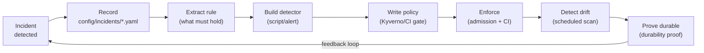

# Human Summary

## What we're building

A machine-checkable system that enforces one principle: **any fix not deployed through
GitOps is temporary state**. This means every manual cluster mutation must either be
reconciled into git within 48 hours or be reverted. The system provides drift detection,
durability proofs, truth state tracking, an incident-to-guardrail pipeline, and a live
mutation ledger -- all with CI gates and verification scripts.

## Why it matters

Manual kubectl patches, emergency exec commands, and "quick fixes" that bypass ArgoCD
have historically caused:
- Silent state drift between git and the live cluster
- Fixes that disappear on pod restart or ArgoCD reconciliation
- Incidents that recur because no regression guard was added
- Ambiguity about whether a fix is temporary or permanent

Without machine-checkable enforcement, "GitOps" is a cultural norm that erodes under
pressure. This spec makes it a verifiable contract.

## Success looks like

- Drift between ArgoCD and git HEAD is detected within 5 minutes and alerted within 10
- Every fix has a durability proof: source in git, synced by ArgoCD, survives pod restart
- No "realized but not durable" entry persists in the truth state matrix for >48 hours
- Every incident older than 7 days has produced a rule, detector, and policy
- Every live cluster mutation is logged with a reconciliation PR reference and TTL

---

# Agent Contract

## Scope

- Drift detection between ArgoCD sync state and git HEAD
- Durability proof methodology for verifying fixes survive restarts and redeployment
- Truth state matrix tracking fixes across 5 levels (branch, merged, realized, proved, durable)
- Incident-to-guardrail pipeline converting incidents into rules, detectors, and policies
- Live mutation ledger tracking all manual cluster operations
- Enforcement policies (Kyverno, alerts, CI gates)
- Cross-reference index linking invariants to their enforcement artifacts

## Non-goals

- Implementing the actual Kyverno policies (those live in bbi-infrastructure)
- Defining the ArgoCD Application resources themselves
- Replacing the existing promotion/realization flow (this spec adds enforcement on top)
- Monitoring infrastructure (Prometheus/Grafana/Alertmanager) setup

## Assumptions

- ArgoCD is the GitOps controller for all K8s deployments
- The rke2-nonprod and rke2-prod clusters are the active deployment targets
- Kyverno is deployed and can enforce admission policies
- The daily-infrastructure-audit.yml workflow is the integration point for scheduled checks
- The process-invariants.yaml and EXECUTION_INVARIANTS.md are the existing invariant registries

---

## Incident-to-Guardrail Flow

Each incident record produces three artifacts (rule, detector, policy). The detector feeds
back into drift detection. Durability proof confirms the guardrail holds under restart and
redeployment. If a proven guardrail fails, it becomes a new incident.

---

## Requirements

### 1. Drift Detection (AC-GIS-001)

The system MUST detect and report state drift between the ArgoCD-managed cluster and git:

- A drift detection script MUST compare ArgoCD application sync status against git HEAD
- The script MUST detect: OutOfSync state persisting >5 minutes, live resource state
  differing from git-declared state, and evidence of manual kubectl patches
- Output MUST be machine-readable JSON with one entry per drift finding, including:
  application name, namespace, sync status, drift type, age, and affected resources
- The script MUST integrate with `daily-infrastructure-audit.yml` as a scheduled check
- The script MUST exit non-zero when critical drift is found (OutOfSync >10 minutes
  on production applications)
- The script MUST be runnable offline (against cached ArgoCD state) for CI static
  validation, and online (against live cluster) for runtime validation

### 2. Durability Proof (AC-GIS-002)

The system MUST provide a methodology to verify that a fix is durable:

- Given a fix identifier (PR number or commit SHA), the proof script MUST verify:
  1. **Source exists in git**: The commit is reachable from `main` (merged, not just branched)
  2. **ArgoCD has synced**: The ArgoCD sync revision matches or is ahead of the fix commit
  3. **Survives pod restart**: After killing the relevant pod, the fix persists when the
     pod reschedules (the fix is in the image or declarative config, not runtime-only)
  4. **Reproducible by bootstrap**: Running the Kustomize overlay from scratch would
     produce the same state (no manual steps required)
- Output MUST be `durability-proof.json` with pass/fail per dimension and evidence
- A fix is "durable" only when all 4 dimensions pass
- The script MUST accept `--dry-run` for offline validation (checks 1 and 4 only)

### 3. Truth State Matrix (AC-GIS-003)

The system MUST track every active fix across 5 truth levels:

| Level | Meaning | Gate |
|-------|---------|------|
| `branch` | Fix exists on a feature branch | PR opened |
| `merged` | Fix merged to main | PR merged |
| `realized` | ArgoCD has synced the fix to the cluster | Sync revision matches |
| `proved` | Runtime proof confirms user-visible behavior | Proof artifact exists |
| `durable` | Fix survives restart and is reproducible | Durability proof passes |

- The truth state matrix MUST be maintained in `config/truth-state-matrix.yaml`
- A generator script MUST be able to populate the matrix from git log, ArgoCD status,
  and acceptance lane results
- CI MUST gate on: no entry may remain at "realized but not durable" for >48 hours
- Each entry MUST include: fix ID, description, current level, timestamps per level,
  and links to proof artifacts

### 4. Incident-to-Guardrail Pipeline (AC-GIS-004)

Every incident MUST produce machine-checkable guardrails:

- Incident records MUST be stored in `config/incidents/` as individual YAML files
- Each incident record MUST include: id, date, summary, root cause, affected layer
  (per the 6-layer authority model), and severity
- Each incident record MUST produce 3 artifacts within 7 days:
  1. **Rule**: A statement of what must hold (added to process-invariants.yaml or
     EXECUTION_INVARIANTS.md)
  2. **Detector**: A script or alert that would catch the same failure class
  3. **Policy**: A Kyverno policy, CI gate, or pre-commit hook that prevents recurrence
- A verification script MUST check that every incident older than 7 days has all 3 artifacts
- The incident schema MUST include fields for: `rule_ref`, `detector_ref`, `policy_ref`
  linking to the produced artifacts

### 5. Live Mutation Ledger (AC-GIS-005)

Every manual cluster mutation MUST be logged:

- The ledger MUST be maintained in `config/live-mutation-ledger.yaml`
- Each entry MUST include: timestamp, command executed, operator (human or agent),
  justification, namespace, affected resources, TTL (max 48 hours), and
  `reconciliation_pr` (link to the PR that makes the mutation durable)
- CI MUST gate on: no entry older than 48 hours without a `reconciliation_pr`
- Entries with an expired TTL and a merged reconciliation PR SHOULD be archived
  (moved to a `resolved` section)
- The ledger MUST be the single source of truth for "what manual changes exist in the
  cluster right now"

### 6. Enforcement Policy (AC-GIS-006)

The system MUST enforce GitOps integrity at multiple levels:

- **Admission control**: A Kyverno ClusterPolicy MUST block `kubectl patch`, `kubectl edit`,
  and `kubectl delete` on resources annotated with `argocd.argoproj.io/tracking-id`,
  except when impersonating the ArgoCD service account
  (see `config/process-invariants.yaml` INV-001 and the gitops-enforcement rule)
- **Alerting**: The system MUST alert (Slack/email) when any ArgoCD application is
  OutOfSync for >10 minutes
- **CI**: The drift detection script MUST run in `daily-infrastructure-audit.yml` and
  block (exit non-zero) when critical drift is found
- **Pre-commit**: Commits that modify `config/live-mutation-ledger.yaml` without a
  `reconciliation_pr` field MUST trigger a warning (not a block, since the PR may not
  exist yet at commit time)

### 7. Cross-Reference Index (AC-GIS-007)

Every invariant MUST be linked to its enforcement artifacts:

- The index MUST be maintained in `config/invariant-enforcement-map.yaml`
- Each invariant entry MUST include:
  - `invariant_id`: Reference to process-invariants.yaml or EXECUTION_INVARIANTS.md
  - `detector_script`: Path to the verification script that checks this invariant
  - `ci_gate`: Workflow job or script registry entry that runs the detector
  - `kyverno_policy`: Name of the Kyverno policy (if applicable), or `null`
  - `incident_origin`: ID of the incident that created this invariant, or `null`
- The index MUST cover all invariants defined in process-invariants.yaml (INV-001
  through INV-016) and EXECUTION_INVARIANTS.md (Invariants 1-10)
- A verification script MUST check that every invariant in the canonical registries
  has a corresponding entry in the enforcement map

---

### Non-Functional Requirements

- Drift detection MUST complete within 60 seconds for up to 50 ArgoCD applications
- Durability proof MUST complete within 5 minutes per fix (pod restart + verification)
- Truth state matrix updates MUST be idempotent (re-running the generator produces
  the same output for the same inputs)
- All verification scripts MUST be runnable without cluster access (offline/static mode)
  with degraded coverage (skip runtime checks, validate schema and cross-references only)
- All YAML config files MUST pass yamllint with the repo's `.yamllint.yml` config

---

## Acceptance Criteria

- [ ] AC-GIS-001: Given the drift detection script runs against a cluster where one
  ArgoCD application has been OutOfSync for >5 minutes, when the script executes, then
  the output JSON MUST contain a drift entry for that application with `drift_type:
  "out_of_sync"` and `age_minutes` >= 5, and the script MUST exit non-zero if
  age_minutes >= 10 on a production application
- [ ] AC-GIS-002: Given a merged PR number, when the durability proof script runs,
  then the output JSON MUST contain pass/fail for all 4 dimensions (source_in_git,
  argocd_synced, survives_restart, reproducible_by_bootstrap), and the overall result
  MUST be "durable" only when all 4 pass
- [ ] AC-GIS-003: Given a truth state matrix entry at level "realized" with a timestamp
  older than 48 hours, when the verification script runs, then it MUST report a failure
  for that entry and exit non-zero
- [ ] AC-GIS-004: Given an incident record in config/incidents/ with a date older than
  7 days, when the verification script runs, then it MUST check that `rule_ref`,
  `detector_ref`, and `policy_ref` are all non-empty and point to existing files or
  YAML entries, and MUST exit non-zero if any are missing
- [ ] AC-GIS-005: Given a live mutation ledger entry with a timestamp older than 48
  hours and no `reconciliation_pr`, when the verification script runs, then it MUST
  report a violation and exit non-zero
- [ ] AC-GIS-006: Given a Kyverno ClusterPolicy is active, when a user (not the ArgoCD
  SA) attempts to kubectl patch a resource with `argocd.argoproj.io/tracking-id`, then
  the request MUST be denied with a message referencing the GitOps integrity policy
- [ ] AC-GIS-007: Given the invariant enforcement map exists, when the verification
  script compares it against process-invariants.yaml, then every invariant MUST have
  a corresponding entry with at least `detector_script` and `ci_gate` populated

---

## Edge Cases

1. **ArgoCD temporarily OutOfSync during normal deploy**: A deploy creates a brief
   OutOfSync window. The drift detector MUST use a minimum age threshold (5 minutes)
   to avoid false positives during normal rollouts.

2. **Emergency break-glass mutation with no internet**: An operator may need to patch
   the cluster when GitHub is unreachable. The ledger entry can omit
   `reconciliation_pr` initially but MUST be updated within 48 hours.

3. **Incident without a clear policy artifact**: Some incidents may not map to a
   Kyverno policy (e.g., process failures). The `policy_ref` field MAY reference a
   CI gate or documentation update instead of a Kyverno policy.

4. **Truth state regression**: A fix that was "durable" may regress to "realized"
   if a subsequent change breaks the bootstrap path. The truth state matrix MUST
   support level demotion, not just promotion.

5. **Multiple fixes in one PR**: A single PR may contain fixes at different truth
   levels for different subsystems. The truth state matrix tracks fixes, not PRs --
   one PR may produce multiple entries.

6. **Stale ledger entries for resolved mutations**: Entries where the reconciliation
   PR is merged and ArgoCD has synced should be archived. The verification script
   MUST only flag entries that are both expired (>48h) and unresolved.

---

## Observability

### Metrics
- `gitops_drift_entries_total` gauge: number of active drift findings (target: 0)
- `gitops_durability_proof_failures` counter: failed durability proofs in last 24h
- `gitops_mutation_ledger_unresolved` gauge: ledger entries without reconciliation PR
- `gitops_incident_guardrail_gap` gauge: incidents older than 7 days missing artifacts

### Alerts
- Alert if any production ArgoCD app is OutOfSync >10 minutes
- Alert if any truth state matrix entry is "realized but not durable" >48 hours
- Alert if any live mutation ledger entry exceeds its TTL without reconciliation PR
- Alert if any incident older than 7 days is missing rule/detector/policy artifacts

### Dashboards
- GitOps integrity dashboard: drift count, ledger status, truth state distribution
- Incident-to-guardrail pipeline: incidents by age, artifact completion rate

---

## Rollout & Rollback

### Rollout Plan
1. Merge spec and config schemas (this PR)
2. Implement verification scripts (stubs first, then full logic)
3. Wire drift detection into daily-infrastructure-audit.yml
4. Populate invariant-enforcement-map.yaml for all existing invariants
5. Backfill incident records for known past incidents
6. Enable CI gates (start as warnings, promote to blockers after 2 weeks)

### Feature Flags
- No feature flags -- this is infrastructure enforcement, not a user-facing feature

### Backward Compatibility
- Existing workflows are not affected until CI gates are promoted to blockers
- Config files are additive (new files in config/, no existing files modified)
- Script stubs exit 0 until fully implemented (CI remains green)

### Rollback Steps
- Remove script entries from script-registry.yaml to disable CI gates
- Verification scripts are independent and can be disabled individually

---

## Open Questions

1. Should the drift detection script use the ArgoCD API directly or parse
   `argocd app list` output? **STATUS**: Prefer API for machine-readable output;
   fall back to CLI for environments without API access.
2. What is the retention period for resolved ledger entries and closed incidents?
   **STATUS**: Propose 90 days in the resolved/archive section, then prune.
3. Should durability proof include a "survives ArgoCD hard refresh" dimension
   in addition to pod restart? **STATUS**: Deferred to v1.1.
